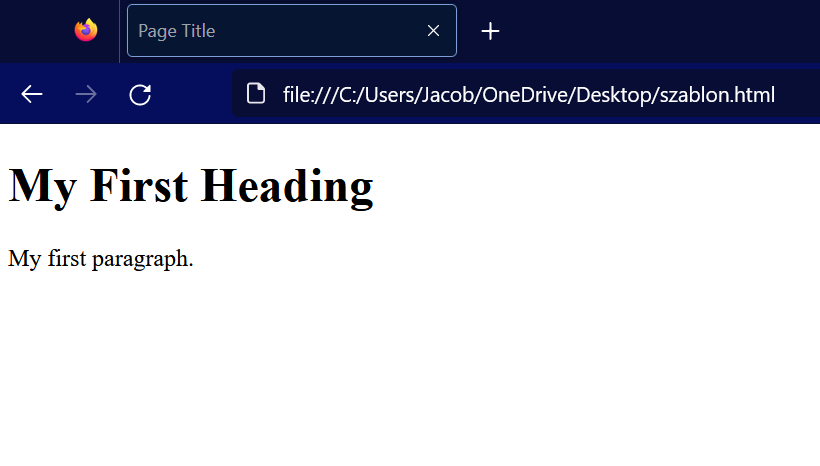
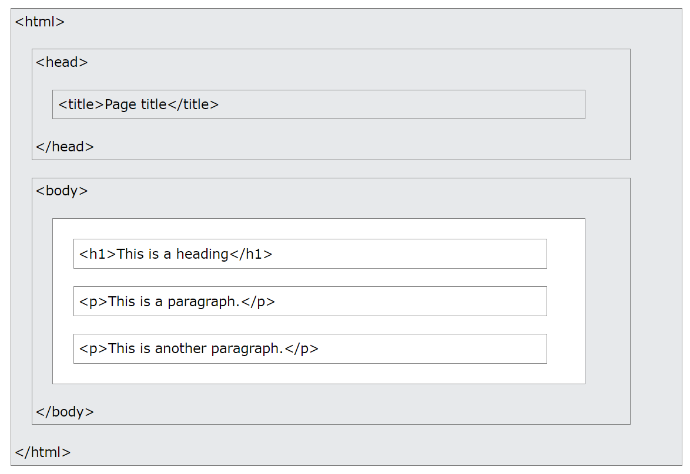

# web-development-course

`Jakub Piskorowski on 20/02/2023 wersja: 1.0`

## Temat: Wprowadzenie do HTML

Składnia języka HTML, struktura dokumentu, tagi i atrybuty.

Pliki źródłowe:
- [szablon.html](szablon.html)

---

## HTML - wprowadzenie

HTML to standardowy język znaczników do tworzenia stron internetowych.
- HTML oznacza Hyper Text Markup Language 
- HTML to standardowy język znaczników do tworzenia stron internetowych 
- HTML opisuje strukturę strony internetowej 
- HTML składa się z szeregu elementów Elementy 
- HTML informują przeglądarkę, jak wyświetlić zawartość Elementy 
- HTML oznaczają fragmenty treści, takie jak "to jest nagłówek", "to jest akapit", "to jest link" itp.

## Prosty dokument HTML

``` HTML
<!DOCTYPE html>
<html>
    <head>
        <title>Page Title</title>
    </head>
    <body>
        <h1>My First Heading</h1>
        <p>My first paragraph.</p>
    </body>
</html>
```
Plik źródłowy: [szablon.html](szablon.html)

Wyjaśnienie przykładu przedstawionego powyżej:
- Deklaracja `<!DOCTYPE html>` określa, że ​​ten dokument jest dokumentem HTML5 
- Element `<html>` jest elementem głównym strony HTML 
- Element `<head>` zawiera meta informacje o stronie HTML 
- Element `<title>` określa tytuł strony HTML (który jest wyświetlany na pasku tytułowym przeglądarki lub w zakładce strony) 
- Element `<body>` definiuje treść dokumentu i jest pojemnikiem na całą widoczną zawartość, taką jak nagłówki, akapity, obrazy, hiperłącza, tabele, listy itp. 
- Element `<h1>` definiuje duży nagłówek 
- Element `<p>` definiuje akapit

## Co to jest element HTML

Element HTML jest definiowany przez znacznik początkowy, część treści i znacznik końcowy:
``` 
<tagname> Treść idzie tutaj </tagname>
```

**Element HTML** to wszystko, od tagu początkowego do tagu końcowego:
``` HTML
<h1> Mój pierwszy nagłówek </h1>
<p> Mój pierwszy akapit </p>
```

| Tag rozpoczynający | Zawartość elementu | Tak kończący |
|----------|:-------------:|------:|
| `<h1>` | Mój pierwszy nagłówek | `</h1>` |
| `<p>` | Mój pierwszy akapit | `</p>` |
| `<br` | brak | brak |

**Uwaga!** Niektóre elementy HTML nie mają treści (np. element `<br>`). Elementy te nazywane są elementami pustymi. Puste elementy nie mają znacznika końcowego!

## Przeglądarka internetowa

Zadaniem przeglądarki internetowej (Chrome, Edge, Firefox, Safari) jest odczytywanie dokumentów HTML i poprawne ich wyświetlanie.

Przeglądarka nie wyświetla znaczników HTML, ale używa ich do określenia sposobu wyświetlania dokumentu:



## Struktura strony HTML

Poniżej została przedstawiona wizualizacja struktury strony HTML:



**Uwaga!** Zawartość sekcji `<body>` (biały obszar powyżej) zostanie wyświetlona w przeglądarce. Zawartość elementu `<title>` zostanie wyświetlona na pasku tytułowym przeglądarki lub w zakładce strony.

## Edytor HTML

Do nauki języka HTML wystarczy prosty edytor tekstu.
**Rekomendowane przeze mnie programy to ``Notepad++`` oraz ``Visual Studio Code``. Każdy z nich możecie za darmo pobrać pod linkami znajdującymi się poniżej:
- [notepad-plus-plus.org/downloads](https://notepad-plus-plus.org/downloads/) - wybieramy najnowszą wersję oraz instalkę 
- [code.visualstudio.com/download](https://code.visualstudio.com/download) - wybieramy system operacyjny

1. Otwórz wybrany przez siebie edytor. 
2. Przepisz tekst przedstawiony poniżej w edytorze.
``` HTML
<!DOCTYPE html>
<html>
    <body>
        <h1>My First Heading</h1>
        <p>My first paragraph.</p>
    </body>
</html>
```
3. Zapisz stronę HTML \
Nazwij plik "index.htm" i ustaw kodowanie na UTF-8 (co jest preferowanym kodowaniem dla plików HTML).
4. Wyświetl stronę HTML na swojej przeglądarce. \
Otwórz zapisany plik HTML w swojej ulubionej przeglądarce (kliknij dwukrotnie plik lub kliknij prawym przyciskiem myszy - i wybierz "Otwórz za pomocą").

## Podstawowe przykłady elementów HTML

### Dokument HTML

Wszystkie dokumenty HTML muszą zaczynać się od deklaracji typu dokumentu: `<!DOCTYPE html>`. \
Sam dokument HTML zaczyna się od `<html>` i kończy na `</html>`. \
Widoczna część dokumentu HTML znajduje się między `<body>` a `</body>`.

Przykład:
``` HTML
<!DOCTYPE html>
<html>
    <body>
        <h1>My First Heading</h1>
        <p>My first paragraph.</p>
    </body>
</html>
```

### Deklaracja <!DOCTYPE>

Deklaracja `<!DOCTYPE>` reprezentuje typ dokumentu i pomaga przeglądarkom poprawnie wyświetlać strony internetowe. \
Musi pojawić się tylko raz, u góry strony (przed wszelkimi znacznikami HTML). \
W deklaracji `<!DOCTYPE>` nie jest rozróżniana wielkość liter. \
Deklaracja `<!DOCTYPE>` dla HTML5 to:
``` HTML
<!DOCTYPE html>
```

### Nagłówki HTML

Nagłówki HTML są definiowane za pomocą znaczników od `<h1>` do `<h6>`. \
`<h1>` określa najważniejszy nagłówek. `<h6>` definiuje najmniej ważny nagłówek:
``` HTML
<h1>To jest nagłówek 1 stopnia</h1>
<h2>To jest nagłówek 2 stopnia</h2>
<h3>To jest nagłówek 3 stopnia</h3>
```

### Akapit

Akapity HTML są definiowane za pomocą znacznika `<p>`:
``` HTML
<p>This is a paragraph.</p>
<p>This is another paragraph.</p>
```

### Linki

Linki HTML są definiowane za pomocą znacznika `<a>`:
``` HTML
<a href="https://www.w3schools.com">This is a link</a>
```

Miejsce docelowe linku jest określone w atrybucie `href`. \
Atrybuty służą do dostarczania dodatkowych informacji o elementach HTML. \
Więcej o atrybutach dowiesz się w późniejszym rozdziale.

### Obrazki

Obrazy HTML są definiowane za pomocą znacznika ``. \
Plik źródłowy (`src`), tekst alternatywny (`alt`), szerokość i wysokość są dostarczane jako atrybuty:
``` HTML

```

## Jak zobaczyć źródło HTML

Czy kiedykolwiek widząc stronę internetową zastanowiłeś się: "Hej! Jak oni to zrobili?"

**Wyświetlenie kodu źródłowego HTML:** \
Kliknij prawym przyciskiem myszy stronę HTML i wybierz **"Wyświetl źródło strony"** (w Chrome) lub **"Wyświetl źródło"** (w Edge) lub podobnie w innych przeglądarkach. Spowoduje to otwarcie okna zawierającego kod źródłowy HTML strony.

**Inspekcja konkretnego element HTML:** \
Kliknij prawym przyciskiem myszy element (lub pusty obszar) i wybierz **"Zbadaj"** lub **"Zbadaj element"**, aby zobaczyć, z czego składają się elementy (zobaczysz zarówno HTML, jak i CSS). Możesz także edytować kod HTML lub CSS na bieżąco w otwartym panelu Elementy lub Style.

## Atrybuty

Atrybuty HTML dostarczają dodatkowych informacji o elementach HTML.

- Wszystkie elementy HTML mogą mieć **atrybuty** 
- Atrybuty dostarczają **dodatkowych informacji** o elementach 
- Atrybuty są zawsze określone w **tagu początkowym** 
- Atrybuty zwykle występują w parach nazwa/wartość, takich jak: **nazwa="wartość"**

### Atrybut href

Znacznik `<a>` definiuje hiperłącze. Atrybut `href` określa adres URL strony, do której prowadzi link:
``` HTML
<a href="https://www.w3schools.com">Visit W3Schools</a>
```

### Atrybut src

Tag `` służy do osadzania obrazu na stronie HTML. Atrybut `src` określa ścieżkę do obrazu, który ma zostać wyświetlony:
``` HTML

```

Istnieją dwa sposoby określenia adresu URL w atrybucie `src`:
1.  **Bezwzględny adres URL** — odsyła do zewnętrznego obrazu znajdującego się na innej stronie internetowej. Przykład: src="https://www.w3schools.com/images/img_girl.jpg".

**Uwaga!** Zewnętrzne obrazy mogą być objęte prawami autorskimi. Jeśli nie uzyskasz pozwolenia na ich użycie, możesz naruszyć prawa autorskie. Ponadto nie można kontrolować obrazów zewnętrznych. Może zostać nagle usunięty lub zmieniony.

2. **Względny adres URL** — odsyła do obrazu znajdującego się w witrynie. Tutaj adres URL nie zawiera nazwy domeny. Jeśli adres URL zaczyna się bez ukośnika, będzie odnosił się do bieżącej strony. Przykład: src="img_dziewczyna.jpg". Jeśli adres URL zaczyna się od ukośnika, będzie odnosił się do domeny. Przykład: src="/images/img_girl.jpg".

**Wskazówka:** prawie zawsze najlepiej jest używać względnych adresów URL. Nie zepsują się, jeśli zmienisz domenę.

### Atrybut wysokości i szerokości

Znacznik `` powinien również zawierać atrybuty `width` i `height` określające szerokość i wysokość obrazka (w pikselach):
``` HTML

```

### Atrybut alt

Wymagany atrybut `alt` dla znacznika `` określa alternatywny tekst dla obrazu, jeśli obraz z jakiegoś powodu nie może zostać wyświetlony. Może to być spowodowane wolnym połączeniem, błędem w atrybucie `src` lub tym, że użytkownik korzysta z czytnika ekranu.

``` HTML

```

### Atrybut style

Atrybut `style` służy do dodawania stylów do elementu, takich jak kolor, czcionka, rozmiar i inne.
``` HTML
<p style="color:red;">This is a red paragraph.</p>
```

### Atrybut lang

Powinieneś zawsze umieszczać atrybut lang wewnątrz znacznika `<html>`, aby zadeklarować język strony internetowej. Ma to na celu pomóc wyszukiwarkom i przeglądarkom.
``` HTML
<!DOCTYPE html>
<html lang="pl">
    <body>
        ...
    </body>
</html>
```

Kody krajów można również dodać do kodu języka w atrybucie lang. Tak więc pierwsze dwa znaki określają język strony HTML, a dwa ostatnie określają kraj.
``` HTML
<html lang="pl-PL">
```

### Atrybut title

Atrybut `title` definiuje dodatkowe informacje o elemencie. \
Wartość atrybutu tytułu zostanie wyświetlona jako podpowiedź **po najechaniu kursorem myszy** na element:
``` HTML
<p title="I'm a tooltip">This is a paragraph.</p>
```

## Zawsze używaj nazwy atrybutów z małych liter

Standard HTML nie wymaga nazw atrybutów pisanych małymi literami. \
Atrybut tytułu (i wszystkie inne atrybuty) można zapisać dużymi lub małymi literami, jak `title` lub `TITLE`. Jednak `W3C zaleca` atrybuty małymi literami w HTML i `wymaga atrybutów małymi literami` dla bardziej rygorystycznych typów dokumentów, takich jak XHTML.

## Pojedyncze czy podwójne cytaty?

Podwójne cudzysłowy wokół wartości atrybutów są najbardziej powszechne w HTML, ale można również użyć pojedynczych cudzysłowów. \
W niektórych sytuacjach, gdy sama wartość atrybutu zawiera podwójne cudzysłowy, konieczne jest użycie pojedynczych cudzysłowów:

## Podsumowanie

- Wszystkie elementy HTML mogą mieć atrybuty 
- Atrybut `href` elementu `<a>` określa adres URL strony, do której prowadzi łącze 
- Atrybut `src` elementu `` określa ścieżkę do wyświetlanego obrazu 
- Atrybuty `width` i `height` elementu `` dostarczają informacji o rozmiarze obrazów 
- Atrybut `alt` znacznika `` zapewnia alternatywny tekst dla obrazu 
- Atrybut `style` służy do dodawania stylów do elementu, takich jak kolor, czcionka, rozmiar i inne 
- Atrybut `lang` znacznika `<html>` deklaruje język strony WWW 
- Atrybut `title` definiuje dodatkowe informacje o elemencie

Źródło: [w3schools.com](https://w3schools.com/html)

---

## Zadania

1. Utwórz nowy dokument HTML i dodaj nagłówek strony w tagu `<head>`, a tytuł strony ustaw na "Moja pierwsza strona".
2. Dodaj na stronie trzy akapity tekstu i użyj tagu `<p>` dla każdego z nich. W pierwszym akapicie napisz kilka zdań o sobie, w drugim akapicie opisz swoje hobby, a w trzecim akapicie napisz, co chciałbyś osiągnąć w przyszłości. Nad każdym akapitem użyj znacznika nagłówkowego w którym umieścisz tytuł akapitu.
3. Dodaj na stronie link do swojego ulubionego serwisu internetowego w tagu `<a>`. Ustaw atrybut "target" na "_blank", aby otwierał się w nowej karcie.
4. Dodaj na stronie obrazek z pliku JPEG lub PNG za pomocą tagu ``. Ustaw atrybut "src" na ścieżkę do pliku obrazu, a atrybut "alt" na opis obrazu.
