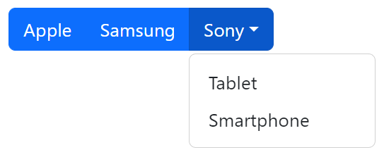

# web-development-course

`Jakub Piskorowski on 05/04/2023 wersja: 1.0`

## Temat: Bootstrap

Przedstawienie działania Frameworka "Bootsrap".

Pliki źródłowe:
- [first-page.html](first-page.html)
- [grid-class.html](grid-class.html)
- [text-color.html](text-color.html)
- [text-bg-color.html](text-bg-color.html)
- [basic-table](basic-table.html)
- [Table striped](./table-striped.html)
- [dark-table-striped.html](dark-table-striped.html)
- [buttons.html](buttons.html)
- [button-group.html](button-group.html)


--- 

## Dlaczego warto używac Bootstrapa? 

Zalety Bootstrapa: 
- **Łatwy w użyciu:** każdy, kto ma tylko podstawową wiedzę na temat HTML i CSS, może zacząć korzystać z Bootstrap 
- **Responsywne funkcje:** Responsywny CSS Bootstrap dostosowuje się do telefonów, tabletów i komputerów stacjonarnych 
- **Podejście mobile-first:** W Bootstrap 3 style mobile-first są częścią podstawowej struktury 
- **Zgodność z przeglądarkami:** Bootstrap jest kompatybilny ze wszystkimi nowoczesnymi przeglądarkami (Chrome, Firefox, Internet Explorer, Edge, Safari i Opera)

## Skąd wziąć Bootstrapa?

Istnieją dwa sposoby rozpoczęcia korzystania z Bootstrap na własnej stronie internetowej. Możesz: 
- Pobierz Bootstrap z getbootstrap.com 
- Dołącz Bootstrap z CDN

Jeśli chcesz samodzielnie pobrać i hostować Bootstrap, przejdź na stronę [getbootstrap.com](https://getbootstrap.com/docs/5.3/getting-started/download/) i postępuj zgodnie z zawartymi tam instrukcjami.

Jeśli nie chcesz samodzielnie pobierać i hostować Bootstrapa, możesz dołączyć go z CDN (Content Delivery Network). MaxCDN zapewnia obsługę CDN dla CSS i JavaScript Bootstrapa.

``` HTML
<!-- Latest compiled and minified CSS -->
<link rel="stylesheet" href="https://cdn.jsdelivr.net/npm/bootstrap@5.3.0-alpha3/dist/css/bootstrap.min.css">

<!-- Latest compiled JavaScript -->
<script src="https://cdn.jsdelivr.net/npm/bootstrap@5.3.0-alpha3/dist/js/bootstrap.bundle.min.js"></script>
```

## Ważna zaleta korzystania z Bootstrap CDN: 

Wielu użytkowników już pobrało Bootstrap z MaxCDN podczas odwiedzania innej witryny. W rezultacie zostanie załadowany z pamięci podręcznej, gdy odwiedzają Twoją witrynę, co prowadzi do szybszego ładowania. Ponadto większość sieci CDN zapewnia, że ​​gdy użytkownik poprosi o plik, zostanie on obsłużony z serwera znajdującego się najbliżej niego, co również prowadzi do szybszego ładowania.

## Stwórz swoją pierwszą stronę internetową za pomocą Bootstrap 5

### 1. Dodaj typ dokumentu HTML5 
Bootstrap 5 używa elementów HTML i właściwości CSS, które wymagają DOCTYPE HTML5. Zawsze umieszczaj dokument HTML5 na początku strony wraz z atrybutem lang oraz poprawnym tytułem i zestawem znaków:
``` html
<!DOCTYPE html>
<html lang="en">
  <head>
    <title>Bootstrap 5 Example</title>
    <meta charset="utf-8">
  </head>
</html>
```

### 2. Bootstrap 5 jest nastawiona na "najważniejszy telefon"

Bootstrap 5 został zaprojektowany tak, aby reagował na urządzenia mobilne. Style zorientowane na urządzenia mobilne są częścią podstawowej struktury. Aby zapewnić prawidłowe renderowanie i powiększanie dotykowe, dodaj następujący tag `<meta>` wewnątrz elementu `<head>`:
``` HTML
<meta name="viewport" content="width=device-width, initial-scale=1">
```

Część `width=device-width` ustawia szerokość strony zgodnie z szerokością ekranu urządzenia (która będzie się różnić w zależności od urządzenia).  
Część `initial-scale=1` ustawia początkowy poziom powiększenia, kiedy strona jest ładowana po raz pierwszy przez przeglądarkę.

### 3. Kontenery

Bootstrap 5 wymaga również elementu do zawijania zawartości witryny.   
Do wyboru są dwie klasy kontenerów:
- Klasa `.container` zapewnia responsywny kontener o stałej szerokości 
- Klasa `.container-fluid` zapewnia kontener o pełnej szerokości, obejmujący całą szerokość przestrzeni


## Dwie podstawowe strony

Poniższy przykład pokazuje kod podstawowej strony Bootstrap 5 (z responsywnym kontenerem o stałej szerokości):
``` HTML
<!DOCTYPE html>
<html lang="en">
    <head>
        <title>Bootstrap Example</title>
        <meta charset="utf-8">
        <meta name="viewport" content="width=device-width, initial-scale=1">
        <link href="https://cdn.jsdelivr.net/npm/bootstrap@5.2.3/dist/css/bootstrap.min.css" rel="stylesheet">
        <script src="https://cdn.jsdelivr.net/npm/bootstrap@5.2.3/dist/js/bootstrap.bundle.min.js"></script>
    </head>
<body>

    <div class="container">
        <h1>My First Bootstrap Page</h1>
        <p>This part is inside a .container class.</p>
        <p>The .container class provides a responsive fixed width container.</p>
    </div>

</body>
</html>
```
Plik źródłowy: [first-page.html](first-page.html)

Poniższy przykład pokazuje kod podstawowej strony Bootstrap 5 (z kontenerem o pełnej szerokości):
``` HTML
<!DOCTYPE html>
<html lang="en">
<head>
  <title>Bootstrap Example</title>
  <meta charset="utf-8">
  <meta name="viewport" content="width=device-width, initial-scale=1">
  <link href="https://cdn.jsdelivr.net/npm/bootstrap@5.2.3/dist/css/bootstrap.min.css" rel="stylesheet">
  <script src="https://cdn.jsdelivr.net/npm/bootstrap@5.2.3/dist/js/bootstrap.bundle.min.js"></script>
</head>
<body>

<div class="container-fluid">
  <h1>My First Bootstrap Page</h1>
  <p>This part is inside a .container-fluid class.</p>
  <p>The .container-fluid class provides a full width container, spanning the entire width of the viewport.</p>
</div>

</body>
</html>
```

---

## Marginesy wewnętrzne kontenera

Domyślnie kontenery mają dopełnienie lewe i prawe, bez dopełnienia górnego i dolnego. Dlatego często używamy narzędzi do `ustawiania odstępów`, takich jak dodatkowe dopełnienie i marginesy, aby wyglądały jeszcze lepiej. Na przykład `.pt-5` oznacza `"dodaj duże dopełnienie u góry"`:
``` HTML
<div class="container pt-5"></div>
```

## Obramowanie kontenera i kolory 

Inne narzędzia, takie jak obramowania i kolory, są również często używane razem z kontenerami:
``` HTML
<div class="container p-5 my-5 border"></div>

<div class="container p-5 my-5 bg-dark text-white"></div>

<div class="container p-5 my-5 bg-primary text-white"></div>
```


## Responsywne kontenery

Możesz także użyć klas `.container-sm|md|lg|xl`, aby określić, kiedy kontener powinien być responsywny. `Maksymalna szerokość` kontenera zmieni się na różnych rozmiarach ekranu/widokach:

|  Klasa | <576px | ≥576px | ≥768px | ≥992px | ≥1200px | ≥1400px |
|---|---|---|---|---|---|---|
| `.container-sm` | 100% | 540px | 720px | 960px | 1140px | 1320px |
| `.container-md` | 100% | 100% | 720px | 960px | 1140px | 1320px |
| `.container-lg` | 100% | 100% | 100% | 960px | 1140px | 1320px |
| `.container-xl` | 100% | 100% | 100% | 100% | 1140px | 1320px |
| `.container-xxl` | 100% | 100% | 100% | 100% | 100% | 1320px |

Przykład:
``` HTML
<div class="container-sm">.container-sm</div>
<div class="container-md">.container-md</div>
<div class="container-lg">.container-lg</div>
<div class="container-xl">.container-xl</div>
<div class="container-xxl">.container-xxl</div>
```

---

## System siatki (Grid)

System siatki Bootstrap jest zbudowany z `Flexbox` i pozwala na maksymalnie `12 kolumn` na stronie.  
Jeśli nie chcesz używać wszystkich 12 kolumn osobno, możesz zgrupować kolumny razem, aby utworzyć szersze kolumny:


Plik Źródłowy: [grid-class.html](grid-class.html)

System siatki jest responsywny, a kolumny będą się automatycznie zmieniać w zależności od rozmiaru ekranu.   
Upewnij się, że ilość kolumn `sumuje się do 12 lub mniej` (nie jest wymagane wykorzystanie wszystkich 12 dostępnych kolumn).

## Klasy siatki (Grid)

System siatki Bootstrap 5 ma sześć klas:
- `.col-` (bardzo małe urządzenia - szerokość ekranu mniejsza niż 576 pikseli) 
- `.col-sm-` (małe urządzenia - szerokość ekranu równa lub większa niż 576px) 
- `.col-md-` (urządzenia średnie - szerokość ekranu równa lub większa niż 768px) 
- `.col-lg-` (duże urządzenia - szerokość ekranu równa lub większa niż 992px) 
- `.col-xl-` (urządzenia xlarge - szerokość ekranu równa lub większa niż 1200px) 
- `.col-xxl-` (urządzenia xxlarge - szerokość ekranu równa lub większa niż 1400px)

## Trzy równe kolumny


Poniższy przykład pokazuje, jak utworzyć trzy kolumny o równej szerokości dla wszystkich urządzeń i szerokości ekranu:
``` HTML
<div class="row">
  <div class="col">.col</div>
  <div class="col">.col</div>
  <div class="col">.col</div>
</div>
```

## Responsywne kolumny


Poniższy przykład pokazuje, jak utworzyć cztery kolumny o równej szerokości, zaczynając od tabletów i skalując je do bardzo dużych komputerów stacjonarnych. **Na telefonach komórkowych lub ekranach o szerokości mniejszej niż 576 pikseli kolumny automatycznie układają się jedna na drugiej:**
``` HTML
<div class="row">
  <div class="col-sm-3">.col-sm-3</div>
  <div class="col-sm-3">.col-sm-3</div>
  <div class="col-sm-3">.col-sm-3</div>
  <div class="col-sm-3">.col-sm-3</div>
</div>
```

---

## Kolory

## Kolor tekstu

Bootstrap 5 ma kilka klas kontekstowych, których można użyć do zapewnienia "znaczenia poprzez kolory". Klasy kolorów tekstu to: `.text-muted`, `.text-primary`, `.text-success`, `.text-info`, `.text-warning`, `.text-danger`, `.text-secondary`, `.text-white`, `.text-dark`, `.text-body` (domyślny kolor nadwozia/często czarny) i `.text-light`:


Przykład:
```HTML
<div class="container mt-3">
        <h2>Contextual Colors</h2>
        <p>Use the contextual classes to provide "meaning through colors":</p>
        <p class="text-muted">This text is muted.</p>
        <p class="text-primary">This text is important.</p>
        <p class="text-success">This text indicates success.</p>
        <p class="text-info">This text represents some information.</p>
        <p class="text-warning">This text represents a warning.</p>
        <p class="text-danger">This text represents danger.</p>
        <p class="text-secondary">Secondary text.</p>
        <p class="text-dark">This text is dark grey.</p>
        <p class="text-body">Default body color (often black).</p>
        <p class="text-light">This text is light grey (on white background).</p>
        <p class="text-white">This text is white (on white background).</p>
    </div>
```
Kod źródłowy: [text-color.html](text-color.html)

## Kolor tła

Klasy kolorów tła to: `.bg-primary`, `.bg-success`, `.bg-info`, `.bg-warning`, `.bg-danger`, `.bg-secondary`, `.bg-dark` i `.bg-light`.
``` HTML
    <div class="bg-primary p-3"></div>
    <div class="bg-success p-3"></div>
    <div class="bg-info p-3"></div>
    <div class="bg-warning p-3"></div>
    <div class="bg-danger p-3"></div>
    <div class="bg-secondary p-3"></div>
    <div class="bg-dark p-3"></div>
    <div class="bg-light p-3"></div>
```

Powyższe klasy `.bg-color` **nie działają dobrze z tekstem**, a przynajmniej musisz określić odpowiednią klasę .text-color, aby uzyskać właściwy kolor tekstu dla każdego tła.

Możesz jednak użyć klas `.text-bg-color`, a Bootstrap automatycznie obsłuży odpowiedni kolor tekstu dla każdego koloru tła:
``` HTML
<p class="text-bg-primary">This text is important.</p>
<p class="text-bg-success">This text indicates success.</p>
<p class="text-bg-info">This text represents some information.</p>
<p class="text-bg-warning">This text represents a warning.</p>
<p class="text-bg-danger">This text represents danger.</p>
<p class="text-bg-secondary">Secondary background color.</p>
<p class="text-bg-dark">Dark grey background color.</p>
<p class="text-bg-light">Light grey background color.</p>
```
Plik źródłowy: [text-bg-color.html](text-bg-color.html)


## Podstawowa tabela

Podstawowa tabela w Bootstrap 5 posiada niewielkie marginesy wewnętrzne oraz poziome przegrody.

Klasa `.table` dodaje podstawowe style do tabeli:
``` HTML
 <table class="table">
    ...
</table>
```
Kod źródłowy: [basic-table](basic-table.html)


## Pasiaste wiersze

Klasa `.table-striped` dodaje do tabeli paski zebry:
``` HTML
<table class="table table-striped">
    ...
</table>
```
Plik źródłowy: [Table striped](./table-striped.html)


## Ciemna, pasiasta tabela

Połącz .table-dark i .table-striped, aby stworzyć ciemną tabelę w paski:
``` HTML
<table class="table table-dark table-striped">
    ...
</table>
```
Plik źródłowy: [dark-table-striped.html](dark-table-striped.html)


## Style przycisków

Bootstrap 5 zapewnia różne style przycisków:

```HTML
<button type="button" class="btn">Basic</button>
<button type="button" class="btn btn-primary">Primary</button>
<button type="button" class="btn btn-secondary">Secondary</button>
<button type="button" class="btn btn-success">Success</button>
<button type="button" class="btn btn-info">Info</button>
<button type="button" class="btn btn-warning">Warning</button>
<button type="button" class="btn btn-danger">Danger</button>
<button type="button" class="btn btn-dark">Dark</button>
<button type="button" class="btn btn-light">Light</button>
<button type="button" class="btn btn-link">Link</button>
```
Plik źródłowy: [buttons.html](buttons.html)

## Grupowanie przycisków

Bootstrap 5 umożliwia grupowanie serii przycisków razem (w jednej linii) w grupę przycisków:


Użyj elementu `<div>` z klasą `.btn-group`, aby utworzyć grupę przycisków:
``` HTML
<div class="btn-group">
  <button type="button" class="btn btn-primary">Apple</button>
  <button type="button" class="btn btn-primary">Samsung</button>
  <button type="button" class="btn btn-primary">Sony</button>
</div>
```
Plik źródłowy: [button-group.html](button-group.html)

## Zagnieżdżanie grup przycisków i rozwijanych menu

Zagnieżdżaj grupy przycisków, aby tworzyć rozwijane menu.


```HTML
<div class="btn-group">
  <button type="button" class="btn btn-primary">Apple</button>
  <button type="button" class="btn btn-primary">Samsung</button>
  <div class="btn-group">
    <button type="button" class="btn btn-primary dropdown-toggle" data-bs-toggle="dropdown">Sony</button>
    <div class="dropdown-menu">
      <a class="dropdown-item" href="#">Tablet</a>
      <a class="dropdown-item" href="#">Smartphone</a>
    </div>
  </div>
</div>
```

--- 

## Zadanie

- Stwórz stronę internetową z menu nawigacyjnym, stopką i jedną sekcją zawierającą tekst.
- Wykorzystaj Bootstrap do tworzenia responsywnych elementów na stronie.
- Użyj komponentów Bootstrapa, takich jak Navbar, Jumbotron i Button, aby dodać interaktywne elementy do strony.
- Stwórz formularz kontaktowy z polami na imię, nazwisko, adres e-mail i wiadomość. Użyj Bootstrapa, aby formularz wyglądał estetycznie i był responsywny.
- Użyj komponentów Bootstrapa, takich jak Alert i Modal, aby dodać interaktywne powiadomienia i okna modalne na stronie.
- Upewnij się, że strona działa poprawnie na różnych urządzeniach, takich jak smartfony, tablety i komputery.