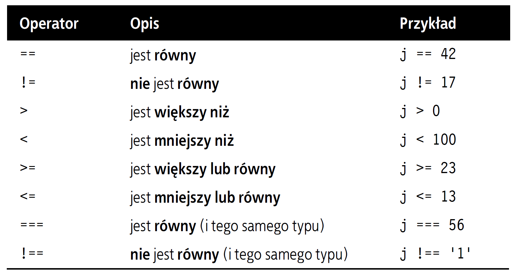
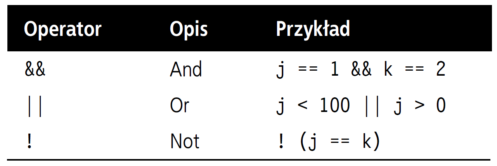

# web-development-course

`Jakub Piskorowski on 13/09/2022 wersja: 1.0`

## Temat: Typy danych w języku JavaScript

Przedstawienie typów danych w języku JavaScript.

Pliki źródłowe: [index.html](index.html)

---

## Objaśnienie

W javaScripcie nie stosuje się znaku wyróżniającego nazwę zmiennej, takiego jak znak dolara w PHP.

### Zmienne znakowe

Łańcuchy znaków w JavaScripcie powinny być ujęte w pojedyńcze lub podwójne znaki cudzysłowu:
``` JavaScript
powitanie = "Witaj!"
uwaga = 'Uważaj'
```

Istniej możliwość zagnieżdżania pojedyńczych cudzysłowów w łańcuchu ujętym w podwójny cudzysłów lub podwójnych cudzysłowów w łańcuchch ujętym w pojedyńczy cudzysłów. Jednak w przypadku zagnieżdżenia cudzysłowów tego samego typu należy je poprzedzić lewym ukośnikiem:
``` JavaScript
powitanie = "\"Witaj!\" to powitanie"
uwaga = '\'Uważaj!\' to ostrzeżenie'
```

### Zmienne numeryczne

W celu utworzenia zmiennej numerycznej wystarczy zdefiniować jej wartość, na przykład tak:
``` JavaScript
licznik = 42
temperatura = 28.4
```

Podobnie jak w przypadku łańcuchów ze zmiennych numerycznych można korzystać w wyrażeniach i funkcjach.

### Tablice

Tablice w JavaScripcie także są bardzo podobne jak w PHP, mogą zawierać łańcuchy znaków, dane numeryczne, a także inne tablice. Aby przypisać wartość do tablicy, użyj następującej składni (w tym przypadku mamy do czynienia z tablicą łańcuchów znaków):
``` JavaScript
zabawki = ['trampolina', 'piłka', 'gwizdek', 'puzzle', 'lalka']
```

Aby utworzyć tablicę wielowymiarową, należy zagnieździć mniejsze tablice w większej. Na przykład w celu utworzenia tablicy dwuwymiarowej odzwierciedlającej kolory jednej ścianki "pomieszanej" kostki rubika, można użyć następującego kodu:
``` JavaScript
scianka =
[
    ['C', 'Z', 'Z'],
    ['B', 'C', 'P'],
    ['Z', 'B', 'Z']
]
```

Poprzedni przykład został sformatowany tak, by na pierwszy rzut oka było widać, o co chodzi, ale można byłoby zapisać ten sam kod w następującej kolejności:
``` JavaScript
scianka = [['C', 'Z', 'Z'],['B', 'C', 'P'],['Z', 'B', 'Z']]
```

Albo nawet takiej:
``` JavaScript
gora = ['C', 'Z', 'Z']
srodek = ['B', 'C', 'P']
dol = ['Z', 'B', 'Z']

scianka = [gora, srodek, dol]
```

Aby wyświetlić kolor pola znajdującego się na drugiej pozycji od góry i trzeciej od lewej, należałoby użyć następującej instrukcji (elementy tablicy numerowane sa od 0):
``` JavaScript
document.write(scianka[1][2])
```

Instrukcja ta spowoduje wyświetlenie litery `P`, jak pomarańczowy.

### Operatory

Operatory w javaScripcie, podobnie jak w PHP, umożliwiają wykonanie działań matematycznych, operacji na łańcuchach, porównywanie elementów i wykonywanie operacji logicznych.

### Operatory arytmetyczne

Operatory arytmetyczne służą do wykonywania działań matematycznych.


### Operatory przypisania

Służą do przypisania wartości zmiennym. Operator `+=` powoduje dodanie wartościznajdującej sie jego po prawej stronie do zmiennej po lewej.


### Operator porównania

Operatory porównania są zwykle stosowane w konstrukcjach takich jak wyrażenia warunkowe `if`, w których zachodzi konieczność porównania dwóch wartości. 



### Operatory logiczne

Operatory logiczne zwykle stosuje się do łączenia rezultatów dwóch operacji porównania, opisanych wczesniej. Zasadniczo jeśli czemuś można przypisac wartość `True` (logiczna prawda) albo `False` (logiczny fałsz), to można wobec takich obiektów zastosować operator logiczny. Operator logiczny przyjmuje dwie prawdziwe lub fałszywe dane i daje rezultat w postaci prawdy lub fałszu. 



### Zwiększanie i zmniejszanie wartości zmiennych

Dodawanie i odejmowanie wartości `1` jest częstym działaniem w różnych językach programowania. Zamiast używać operatorów `+=` oraz `-=`, można skorzystac z następujących konstrukcji:
``` JavaScript
++$x;
--$x;
```

### Konkatenacja łańcuchów znaków

Konkatenacja łańcuchów znaków w JavaScripcie przebiega troche inaczej niż w PHP. Zamiast operatora `.`(kropka) stosowany jest znak `+`(plus):
``` JavaScript
document.write("Masz "+ wiadomosci + " wiadomosci.")
```

Przy założeniu że zmienna `wiadomosc` ma wartość `3`, wynik działania powyżeszego kodu będzie następujący:
``` text
Masz 3 wiadomości
```

Podobnie jak można dodać wartość do zmiennej numerycznej przy użyciu operatora `+=`, w analogiczny sposób można dołaczyć jeden łańcuch znaków do innego:
``` JavaScript
imie = "James"
imie += " Dean"
```

### Znaki modyfikujące

Modyfikatory, z którymi zapoznałeś się już wcześniej przy wstawianiu cudzysłowów w łańcuchach, mogą służyć również do umieszczenia w tekście znaków specjalnych, takich jak tabulatory, powrót karetki i znak nowego wiersza. \
Przykład zastosowania tabulatorów do sformatowania nagłówka tabeli:
``` JavaScript
naglowek = "Imię\tWiek\tMiasto"
```

Tabela zawierająca zestawienie dostępnych znaków modyfikujących:


Źródło: [Książka "PHP, MySQL i JavaScript", Wydawnictwo: Helion](https://helion.pl/ksiazki/php-mysql-i-javascript-wprowadzenie-wydanie-v-robin-nixon,phmyj5.htm#format/e)

<!--
---
## Pytania
1. W jakich znacznikach należy zamknąć kod JavaScript?
2. Jak tworzy się komentarze w JavaScripcie?
3. Jaki symbol jest operatorem konkatenacji łańcuchów znaków w javaScripcie?
4. Jaki znak modyfikujący służy do wstawienia: znaku tabulatora, znaku nowej linii 
 -->