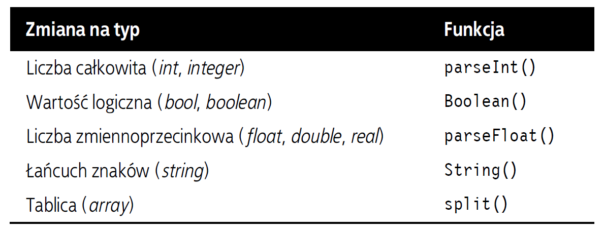

# web-development-course

`Jakub Piskorowski on 21/09/2022 wersja: 1.0`

## Temat: Pętle

Przedstawienie działania instrukcji sterujących.

Pliki źródłowe: 
- [while.html](while.html)
- [do-while.html](do-while.html)
- [for.html](for.html)

---

## Objaśnienie

JavaScript przypomina PHP także pod względem składni pętli. Obydwa języki obsługują pętle `while`, `do ... while` oraz `for`.

### Pętla while

Pętla `while` najpierw sprawdza wartość wyrażenia i przystępuje do wykonywania zawartych w niej instrukcji, tylko wtedy, gdy wyrażenie to zwróci `true`. Po zakończeniu wykonywania jednej iteracji pętli wyrażenie jest ponownie sprawdzane, a jeśli znów zwróci wartość `true`, pętla jest wykonywana po raz kolejny, i tak dalej, aż do chwili, gdy wyrażenie będzie miało wartość `false` lub wykonanie pętli zostanie przerwane. 

``` JavaScript
<script type="text/javascript">
    counter = 0

    while (counter < 5)
    {
        document.write("Licznik: " + counter + "<br>")
        ++counter
    }
</script>
```
Kod źródłowy: [while.html](while.html)

Wynik działania programu:
``` text
Licznik: 0
Licznik: 1
Licznik: 2
Licznik: 3
Licznik: 4
```

### Pętla do ... while

Jeśli sytuacja wymaga, by pętla wykonała się przynajmniej raz, jeszcze przed sprawdzeniem warunku jej działania, użyj konstrukcji `do ... while`, która jest podobna do pętli `while`, z tą różnicą, że wyrażenie warunkowe jest sprawdzane dopiero po każdej iteracji. 

``` JavaScript
<script type="text/javascript">
    count = 1

    do
    {
        document.write(count + " razy 7 wynosi " + count*7 + "<br>")
    }while (++count <= 7)
</script>
```
Kod źródłowy: [do-while.html](do-while.html)

Wynik działania programu:
``` text
1 razy 7 wynosi 7
2 razy 7 wynosi 14
3 razy 7 wynosi 21
4 razy 7 wynosi 28
5 razy 7 wynosi 35
6 razy 7 wynosi 42
7 razy 7 wynosi 49
```

### Pętle for 

Pętla `for` łączy w sobie zalety wszystkich poprzednich. Jej składnia umożliwia zastosowanie trzech następujących parametrów:
- wyrażenia inicjalizującego
- wyrażenia warunkowego
- wyrażenia modyfikującego

Te trzy parametry są rozdzielone średnikami `for (wyr1; wyr2; wyr3)`. Na początku pierwszej pętli wykonywane jest wyrażenie inicjalizujące. W przypadku programu z tabliczką mnożenia przez 7 polegałoby ono na zainicjalizowaniu zmiennej `count` z wartością `1`. następnie przy każdym wykonaniu pętli jest badane wyrażenie warunkowe (w tym przypadku miałoby ono postać `count <= 7`), a instrukcje w pętli są wykonywane tylko wówczas, gdy zwraca ono wartość `true`. Wreszcie na końcu każdej iteracji wykonywane jest wyrażenie modyfikujące. W przypadku skryptu z tabliczką mnożenia jego działanie polegałoby na inkrementacji zmiennej `count`.

``` JavaScript
    for (count = 1; count <= 7; ++count){
        document.write(count +" razy 7 wynosi " +count*7 +"<br>");
    }
```
Kod źródłowy: [for.html](for.html)

### Typowanie jawne

W odróżnieniu od PHP w JavaScripcie nie da się jawnie deklarować typów takich jak (`int`) albo (`float`). Jeżeli zależy ci na nadaniu zmiennej określonego typu, powinieneś użyć jednej z wbudowanych funkcji JavaScriptu, przedstawionych poniżej:



Jeśli na przykład chciałbyś zmienić liczbę zmiennoprzecinkową na całkowitą, mógłbyś uzyć następującego kodu (który wyświetli wartość 3):
``` JavaScript
    n = 3.1415927
    i = parseInt(n)
    document.write(i)
```

Lub analogicznego, ale w zwięźlejszej formule:
``` JavaScript
document.write(parseInt(3.1415927))
```

Źródło: [Książka "PHP, MySQL i JavaScript", Wydawnictwo: Helion](https://helion.pl/ksiazki/php-mysql-i-javascript-wprowadzenie-wydanie-v-robin-nixon,phmyj5.htm#format/e)

<!--
---

Pytania:
1. Jaka jest różnica między pętlą `for` a `while`?
2. jaka jest różnica między pętlą `while` a `do ... while`?

-->