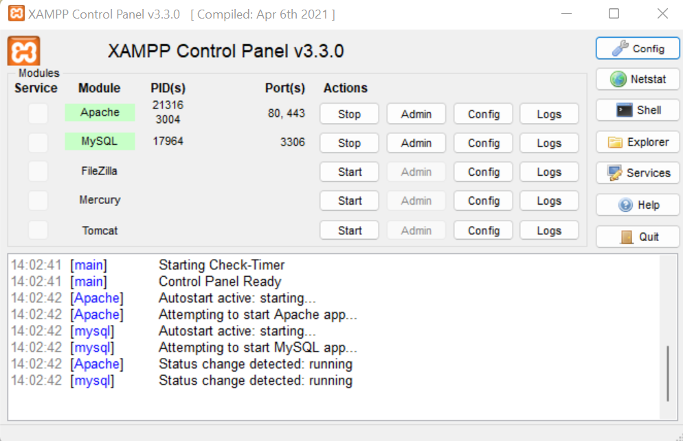
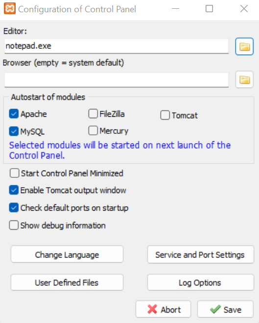

# web-development-course

`Jakub Piskorowski on 26/08/2022 wersja: 1.0`

## Temat: Instalowanie pakietów XAMPP

Przedstawienie procesu instlacji i konfiguracji pakietów XAMPP.

---

## Objaśnienie

WAMP to skrót do określeń "Windows, Apache, MySQL i PHP". Te skróty opisują w pełni funkcjonalny zestaw narzędzi służących do projektowania dynamicznych stron internetowych. \
Systemy typu WAMP są dostępne w formie pakietów zawierających wszystkie potrzebne narzędzia i przygotowanych tak aby nie trzeba było ich konfigurować oddzielnie. To oznacza że wystarczy pobrać pojedyńczy program a potem zaintalować go w kilku prostych krokach aby w krótkim czasie, przy minimalnym nakładzie pracy dysponować działającym serwerem testowym.

## Instalacja

Istnieje kilka pakietów typu WAMP, różniących się szczegółami konfiguracji, ale spośród programów open source oraz darmowych tego typu prawdopodobnie najlepszym jest XAMP, który można pobrać pod adresem [apachefriends.org](https://www.apachefriends.org)

Po zainstalowaniu i odpaleniu programu XAMP otrzymamy poniżej przedstawiony Panel kontrolny.

Najlepiej zacząć od kliknięcia przycisku `Config`, znajdującego się w prawym, górnym rogu panelu sterowania, który wyświetli okno konfiguracji, przedstawione na obrazku poniżej. Zaznaczyć opcję `Apache` oraz `MySQL`, dzieki temu wybrane usługi będą uruchamiały się automatycznie. 

Domyślnie serwerowi Apache jest przypisany port 80 oraz 443 dla połączeń SSL, zaś serwerowi MySQL port 3306. 

Po naciśnięci w przycisk `Explorer` zostaniemy przekierowani do folderu głównego XAMPP. W podfolderze `htdocs` możemy umieszczać pliki naszej strony aby móc je odpalić za pomocą serwera Apache. 

## Testowanie instalacji

W celu sprawdzenia czy wszystko działa należy spróbować wyświetlić domyślną stronę główną. Wpisz w adresie przeglądarki jeden z dwóch adresów: 
- `localhost`
- `127.0.0.1`

Słowo `localhost` użyte w roli adresu oznacza lokalny komputer i stanowi odpowiednik adresu IP `127.0.0.1`. 

Źródło: [Książka "PHP, MySQL i JavaScript", Wydawnictwo: Helion](https://helion.pl/ksiazki/php-mysql-i-javascript-wprowadzenie-wydanie-v-robin-nixon,phmyj5.htm#format/e)

---

## Ćwiczenie 

Stwórz prosty dokument wyświetlający napis "Hello World". Za pomocą edytora tekstu `Notepad++` lub `Visual Studio Code`. Zachowując podstawową strukturę pliku HTML. 