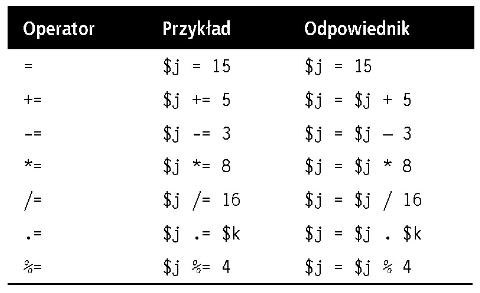

# web-development-course

`Jakub Piskorowski on 08/09/2022 wersja: 1.0`

## Temat: Zmienne i operatory

Przedstawienie zmiennych i operatorów w języku PHP.

---

## Objaśnienie

## Zmienne 

## Zmienne tekstowe

Wyobraź sobie że masz pudełko zapałek z napisem `username`, czyli użytkownik. Następnie bierzesz małą kartkę papieru, piszesz na niej `Jan Kowalski` i wkładasz ją do pudełka.
``` php
$username = "Jan Kowalski";
```

Użycie cudzysłowów oznacza, że "Jan Kowalski" jest łańcuchem znaków. \
Tę samą wartość możesz przypisac do innej zmiennej (kserujesz kartkę i wkładasz ją do innego pudełka). 
``` php
$currentUser = $username
```


## Zmienne numeryczne

Zmienne nie muszą zawierać łańcuchów tekstowych, można w nich przechowywać także liczby. Wracając do analogii z pudełkiem zapałek: jeśli chciałbyś np. zapisać wartość `17` w zmiennej o nazwie `$count`, to odpowiadałoby to przykładowo umieszczeniu 17 koralików w pudełku z napisem `count`.
``` php
$count = 17;
```
Nic nie stoi na przeszkodzie aby umieścic liczbę zmiennoprzecinkową. Składnia jest identyczna.
``` php
$count = 17.5;
```

## Tablice

Czym są tablice? Możesz je potraktować jak zestaw sklejonych ze sobą pudełek. Przypuśćmy że chcesz zapisać imiona pięcioosobowej drużyny piłkarskiej w tablicy o nazwie `$team`. Aby to zrobić, mógłbyś skleić bokami pięć pudełek od zapałek, zapisac imiona poszczególnych graczy na kartkach papieru i włożyć po jednej takiej kartce do każdego pudełka. 
``` php
$team = array('Jan', 'Maria', 'Robert', 'Krzysztof', 'Anna');
```


Kod deklaracji tablicy opera sie o następującej konstrukcji `array();`.

Jeśli chciałbyś sprawdzić, jak ma na imie gracz numer 4, mógłbyś to zrobić za pomoca następującej instrukcji:
``` php
echo $team[3]; // Wyświetla imię Krzysztof
```
Powodem, dla którego w instrukcji została uzyta liczba 3, a nie 4, jest fakt, że pierwszy element tablicy w PHP ma numer zerowy. To zaś oznacza że gracze mają w niej numery od 0 do 4.

## Tablice dwuwymiarowe 

tablice mają znacznie większe możliwości. Tablica nie musi być jednowymiarowa, jak przykładowy ciąg pudełek zapałek. Może być dwuwymiarowa albo mieć trzy lub więcej wymiarów.

Jako przykład dwuwymiarowej tablicy weźmy grę w kółko i krzyżyk, która wymaga zdefiniowania struktury danych dla dziewięciu komórek ułożonych w kwadratowy diagram 3x3. Aby odzwierciedlić taką strukturę za pomocą pudełek zapałek, wyobraź sobie, że dziewięć takich pudełek sklejono w konstrukcję składającą się z trzech rzędów i trzech kolumn. 


Teraz w poszczególnych pudełkach możesz umieścić kartki papieru z krzyżykiem ("x") albo kółkiem ("o") dla każdego wykonanego ruchu. 

Aby zrobić to w kodzie PHP, należałoby zdefiniować tablicę zawierającą trzy inne tablice.
``` php
<?php
    $oxo = array(array('x',' ', 'o'),
                array('o', 'o', 'x'),
                array('x', 'o', ' '));
?>
```

Aby sprawdzić wartość trzeciego elementu w drugim rzędzie takiej tablicy, trzeba byłoby użyć następującej instrukcji PHP.
``` php
echo $oxo[1][2];
```

## Zasady nazwenictwa zmiennych

 Przy tworzeniu nazw zmiennych w języku PHP należy przestrzegać kilku zasad:
 - Nazwy zmiennych muszą się zaczynać literą alfabetu albo znakiem _ (podkreśleniem).
 - Nazwy zmiennych mogą zawierać tylko litery a-z, A-Z, zyfry 0-9 oraz znak _ (Podkreślenia).
 - nazwy zmiennych nie mogą zawierać spacji. Jeśli chcesz nadać zmiennej nazwę składającą się z kilku słów, rozdziel je znakiem _ (Podkreślenia) np. $$nazwa_uzytkownika.
 - Wielkość liter w nazwach zmiennych ma znaczenie. Zmienna $Rekord nie jest równoznaczna ze zmienną $rekord.

## Operatory arytmetyczne

Operatory arytmetyczne służą do wykonywania działań matematycznych.


## Operatory przypisania

Służą do przypisania wartości zmiennym. Operator `+=` powoduje dodanie wartościznajdującej sie jego po prawej stronie do zmiennej po lewej.



## Operator porównania

Operatory porównania są zwykle stosowane w konstrukcjach takich jak wyrażenia warunkowe `if`, w których zachodzi konieczność porównania dwóch wartości. 


## Operatory logiczne

Operatory logiczne zwykle stosuje się do łączenia rezultatów dwóch operacji porównania, opisanych wczesniej. Zasadniczo jeśli czemuś można przypisac wartość `True` (logiczna prawda) albo `False` (logiczny fałsz), to można wobec takich obiektów zastosować operator logiczny. Operator logiczny przyjmuje dwie prawdziwe lub fałszywe dane i daje rezultat w postaci prawdy lub fałszu. 


## Zwiększanie i zmniejszanie wartości zmiennych

Dodawanie i odejmowanie wartości `1` jest częstym działaniem w różnych językach programowania. Zamiast używać operatorów `+=` oraz `-=`, można skorzystac z następujących konstrukcji:
``` php 
++$x;
--$x;
```

W połaczeniu z porównaniem (instrukcji `if`):
``` php
if (++$x == 10) echo $x;
```
Taka składnia informuje PHP, że należy najpierw zwiększyć wartośc zmiennej $x, a potem sprawdzić, czy jest ona równa 10.
``` php
if ($y-- == 0) echo $x;
```
Taki zapis ma nieco inne znaczenie. Najpierw sprawdzane jest czy zmienna $y jest równa 0, a potem wartość jest zwiększana o 1. 

## Konkatenacja łańcuchów znaków

Operatorem konkatenacji jest kropka (.), zaś sama operacja polega na połączeniu dwóch łańcuchów znaków.
``` php
echo "Masz ". $msgs ." wiadomości.";
```

Na tej samej zasadzie na jakiej można dodać liczbę do bieżącej wartości zmiennej za pomocą operatora `+=`, przy użyciu operatora `.=` można dodać jeden łańcuch znaków do drugiego.
``` php
$bulletin .= $newflash;
```
W rezultacie zmienna $bulletin będzie zawierała obydwa źródłowe łańcuchy znaków. 

## Deklaracja typu zmiennych

PHP należy do języków o słabym typowaniu. To oznacza, że typ zmiennej nie musi być zadeklarowany przed jej uzyciem, a przy odwoływaniu się do tej zmiennej PHP zawsze potraktuje ją jako zmienną takiego typu, który wynika z kontekstu zastosowania.  


Źródło: [Książka "PHP, MySQL i JavaScript", Wydawnictwo: Helion](https://helion.pl/ksiazki/php-mysql-i-javascript-wprowadzenie-wydanie-v-robin-nixon,phmyj5.htm#format/e)

<!--
---

## Pytania 

1. Jaki znacznik inicjuje przetwarzanie kodu przez interpreter PHP? Jaka jest skrócona postać tego znacznika?
2. Przedstaw dwa znaczniki służące do tworzenia komentarzy.
3. Jaki znak należy umieścić na końcu każdego wiersza kodu PHP?
4. Jakim symbolem poprzedza się wszystkie zmienne w PHP?
5. Co mogą przechowywać zmienne?
6. na czym polega różnica między wyrażeniem `$zmienna = 1` a `$zmienna == 1`?
7. Czy w nazwach zmiennych rozróżniana jest wielkośc liter?
8. Czy w nazwach zmiennych mozna używac spacji?
9. na czym polega różnica między wyrażeniami `++$j` a `$j++`?

-->
