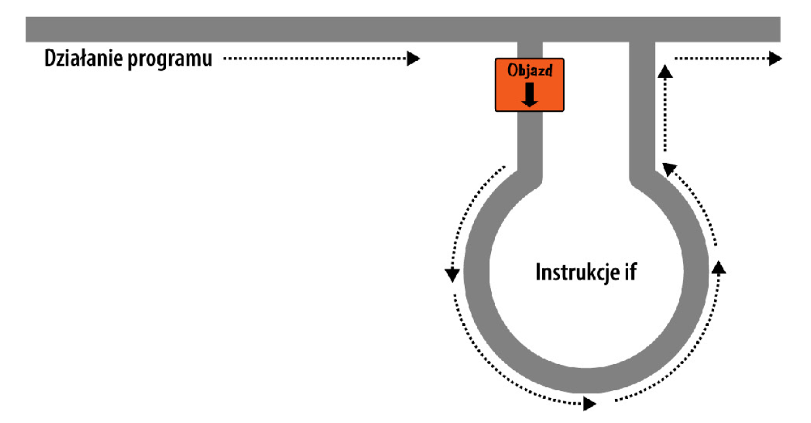
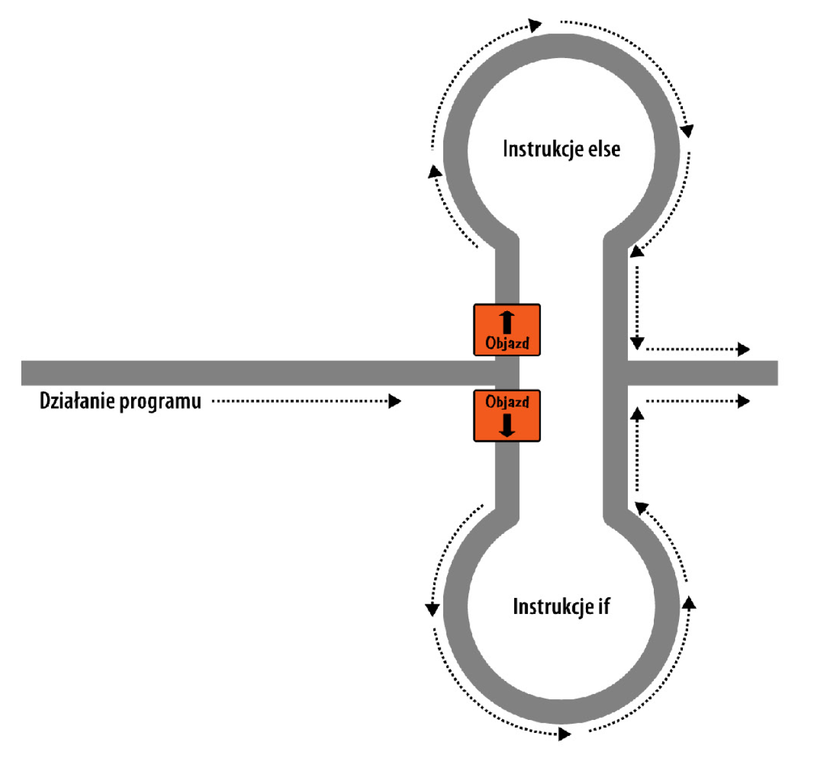
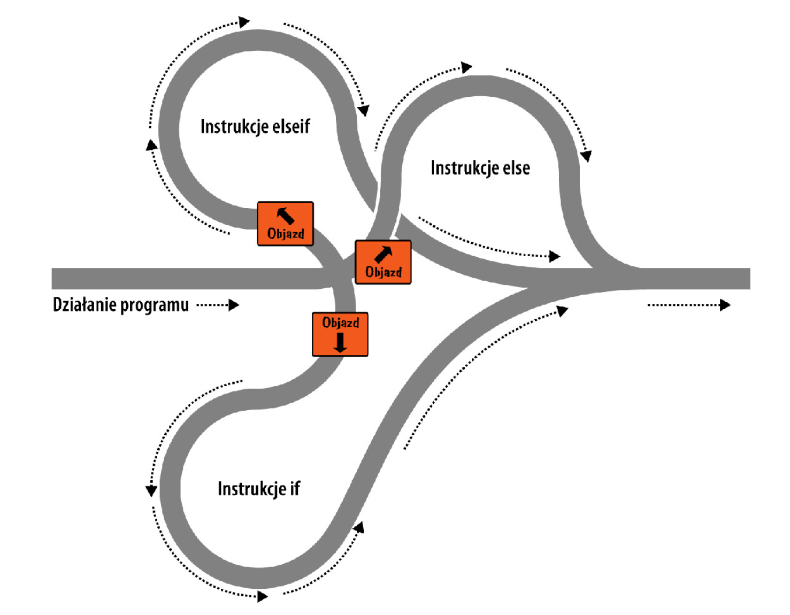

# web-development-course

`Jakub Piskorowski on 09/09/2022 wersja: 1.0`

## Temat: Wyrażenia warunkowe

Przedstawienie działania wyrażeń warunkowych.

---

## Objaśnienie

Wyrażenia warunkowe umożliwiają zmianę przebiegu wykonania programu. Pozwalają na stawianie pytań dotyczących konkretnych kwestii i podejmowanie działań w zależności od odpowiedzi na te pytania.

## Instrukcja if

W przypadku instrukcji `if` taki znak to rodzaj objazdu, na który należy zjechać, jeśli są spełnione (`TRUE`) odpowiednie warunki. Jeśli tak się dzieje, zjeżdżasz i podążasz objazdem aż do punktu wyjścia, a potem kontynuujesz jazdę w pierwotnym kierunku. Jeśli warunki nie są spełnione, ignorujesz objazd i jedziesz prosto.



Zawartością instrukcji `if` może być dowolne poprawne wyrażenie języka PHP, takie jak: równość, porównanie, sprawdzenie wartości zerowej NULL, a także wartość zwracana przez funkcję (zarówno wbudowaną, jak i taką, którą napisałeś sam).

**Przykład:**
``` php
<?php
    if ($bank_balance < 100)
    {
        $money = 1000;
        $bank_balance += $money;
    }
?>
```

W tym przypadku bierzesz pod lupę stan konta, a konkretnie sprawdzasz, czy znajduje się na nim mniej niż 100 zł. Jeśli tak, przygotowujesz 1000 zł i wpłacasz je na konto. (Gdyby zarabianie pieniędzy było tak proste). Jeśli stan konta wynosi 100 zł lub więcej, instrukcje w wyrażeniu warunkowym sa ignorowane, a program kontynuuje działanie od następnego wiersza.

# Instrukcja else

W konstrukcji `if ... else` pierwsza instrukcja warunkowa jest wykonana, jeśli warunek zwrócił wartość `TRUE`. Ale jeśli zwróci wartość `FALSE`, wykonana jest druga instrukcja. To oznacza, że **zawsze** jest wykonana jedna z dwóch instrukcji. W żadnym wypadku nie może dojść do sytuacji, że wykonane zostaną obie (lub żadna). 



**Przykład:**
``` php
<?php
    if($bank_balance < 100)
    {
        $money = 1000;
        $bank_balance += $money;
    }
    else
    {
        $savings += 50;
        $bank_balance -= 50;
    }
?>
```

W tym przykładzie po sprawdzeniu, że masz na koncie w banku ponad 100 zł, wykonana jest instrukcja `else`, która powoduje zasilenie stanu rachunku oszczędnościowego niewielką kwotą. 

## Instrukcja elseif

W pewnych sytuacjach może ci zależeć na wykonaniu wielu różnych działań, na wypadek zajścia odmiennych okoliczności, weryfikowanych za pomocą sekwencji warunków. Taki efekt można uzyskać za pomoca instrukcji `elseif`. Nietrudno zgadnąć, że jest ona podobna do instrukcji `else`, z tą różnicą że pozwala sprawdzić jeszcze jeden warunek przed wykonaniem kodu związanego z instrukcją `else`.

**Przykład:**
``` php
<?php
    if($bank_balance < 100)
    {
        $money = 1000;
        $bank_Balance += $money;
    }
    elseif($bank_balance > 200)
    {
        $savings += 100;
        $bank_balance -= 100;
    }
    else
    {
        $savings += 50;
        $bank_balance -= 50;
    }
?>
```

W tym przykładzie instrukcja `elseif` została umieszczona pomiędzy instrukcjami `if` oraz `else`. Sprawdza ona, czy stan konta w banku przekracza 200 zł, jeśli tak, to 100 zł z tej kwoty przenosi na rachunek oszczędnościowy.

Choć metafora z jezdnią może już sprawiać wrażenie trochę naciąganej, to można sobie wyobrazić tego rodzaju konstrukcję jako kilka kolejnych zjazdów z głównej trasy.



## Instrukcja switch

Instrukacja `switch` przydaje się w sytuacjach, gdy jakaś zmienna lub rezultat wyrażenia mogą przyjmować różne wartości, a każda z nich powinna inicjować inne zadania.

Przypuśćmy, że mamy do czynienia z napisanym w PHP menu, które przekazuje do głównego kodu pojedyńczy łańcuch znaków, zależny od działań podejmowanych przez użytkownika. Powiedzmy że do wyboru sa odsyłacze: Strona główna (Home), Informacje (About), Aktualności (News), Logowanie (Login) oraz Odsyłacze (Links), a ty zmieniasz wartości zmiennej $page na zgodną z wyborem użytkownika.

```php
<?php
    switch($page)
    {
        case "Home":
            echo "Wybrałeś stronę główną";
            break;
        case "About":
            echo "Wybrałeś informacje";
            break;
        case "News":
            echo "Wybrałeś Aktualności";
            break;
        case "Login":
            echo "Wybrałeś logowanie";
            break;
        case "Links":
            echo "Wybrałeś odsyłacze";
            break;
    }
?>
```

Jak widać zmienna `$page` jest wymieniona tylko raz, na początku instrukcji `switch`. Następnie do zweryfikowania prawdziwości warunków została użyta instrukcja `case`. Jeśli zachodzi zgodność, wykonywana jest instrukcja powiązana z danym warunkiem. Oczywiście w prawdziwym programie byłby to kod powodujący wyświetlenie odpowiedniej strony lub przejście do niej, a nie zwykly napis informacyjny. 

Często spotykany wariant instrukcji `switch` obejmuje definicję akcji domyślnej, wykonanej w sytuacji, gdy żaden z warunków `case` nie został spełniony. 

``` php
    default:
        echo "Nierozpoznany wybór";
        break;
```

## Operator ?

Jednym ze sposobów na uniknięcie dość rozwlekłej konstrukcji wyrażeń warunkowych `if` oraz `else` jest zastosowanie zwięzłego operatora `?`, który jest w tym sensie nietypowy, że wymaga podania trzech operandów zamiast dwóch, jak jest w większości przypadków. 

Do operatora `?` należy przekazać wyrażenie oraz dwie instrukcje, których wykonanie jest uzależnione od wartości logicznej wspomnianego wyrażenia. Jedna zostanie wykonana, gdy zwróci ci ono wartość `TRUE`, a druga, jeśli będzie to wartość `FALSE`. Przykład poniżej przedstawia kod, którego można byłoby użyć do wyświetlenia komunikatów o stanie paliwa.

``` php
<?php
    echo $fuel <= 5 ? "Musisz zatankować" : "Masz wystarczająco paliwa";
?>
```

W tym przykładzie jeśli paliwa jest mniej niż 5 l (a konkretnie jeśli zmienna `$fuel` ma wartośc mniejszą niż 5), ciąg znaków `"Musisz zatankować"` jest przekazywany do instrukcji `echo`. W przeciwnym razie jest do niej przesyłany łańcuch `"Masz wystarczająco paliwa"`. Wartość zwróconą przez instrukcję `?` można też przypisac do zmiennej.

``` php
<?php
    $enough = $fuel <= 5 ? FALSE : TRUE;
?>
```
W tym przypadku zmiennej `$enough` zostanie przypisana wartość `TRUE`, tylko jeśli w baku będzie co najmniej 5 l paliwa, w przeciwnym razie zmienna otrzyma wartość `FALSE`.


Źródło: [Książka "PHP, MySQL i JavaScript", Wydawnictwo: Helion](https://helion.pl/ksiazki/php-mysql-i-javascript-wprowadzenie-wydanie-v-robin-nixon,phmyj5.htm#format/e)

<!--
---

## Pytania 

1. Jakie wartości liczbowe są reprezentowane przez wartości logiczne TRUE i FALSE?
2. Wymień trzy rodzaje instrukcji warunkowych.
3. jakie inne wyrażenie zastępuje operator `?`.

-->