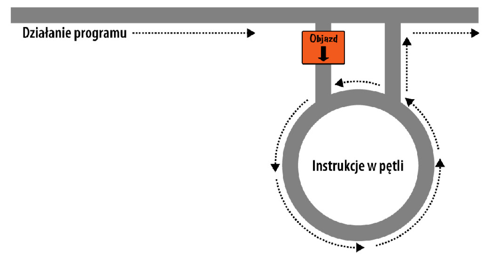

# web-development-course

`Jakub Piskorowski on 10/09/2022 wersja: 1.0`

## Temat: Pętle

Przedstawienie działania pętli w języku PHP.

Pliki źródłowe:
- [while.php](while.php)
- [do-while.php](do-while.php)
- [for.php](for.php)

---

## Objaśnienie

Aby zapoznac się z działaniem pętli, przyjżyj się rysunkowi poniżej. jest bardzo podobny do ilustracji będących metaforą instrukcji if, z tym że po zjeździe z głównej trasy trafiamy na rondo, z którego można wyjechać tylko po spełnieniu określonych warunków.



## Pętla while

Wróćmy do przykładu z deską rozdzielczą samochodu i umieśćmy jej kod w pętli `while`, która podczas jazdy nieustannie analizuje poziom paliwa.

``` php
<?php
    $fuel = 10;

    while($fuel > 1)
    {
        // Jedź dalej...
        echo "Masz wystarczająco paliwa";
    }
?>
```

Zasadniczo zamiast komunikatu tekstowego lepiej byłoby pewnie wyświetlić zieloną kontrolkę, ale chodzi o ideę, w pętli `while` umieścilismy pozytywną informację o stanie paliwa. Nawiasem mówiąc, jeśli wypróbujesz ten przykład, zwróć uwagę, że podany komunikat tekstowy będzie powtarzany bez końca, dopóki nie klikniesz przycisku zatrzymaj w przeglądarce. 

Przykład poniżej przedstawia zastosowanie pętli `while`, polegające na wyświetleniu tabelki z wynikami mnożenia kolejnych liczb przez 12.

``` php
<?php
    $count = 1;

    while($count <=12)
    {
        echo "$count pomnożone przez 12 wynosi ". $count * 12 ."<br>";
        ++$count;
    }
?>
```

Plik źródłowy: [while.php](while.php)

Jak widać,  najpierw zmienna `$count` jest inicjalizowana z wartością 1, a następnie mamy do czynienia z pętlą `while` operającą się na porównaniu w postaci `$count <= 12`. Ta pętla będzie wykonywana do chwili, gdy wartość badanej zmiennej będzie większa od `12`. 

Wynik działania programu:
``` text
1 pomnożone przez 12 wynosi 12
2 pomnożone przez 12 wynosi 24
3 pomnożone przez 12 wynosi 36
4 pomnożone przez 12 wynosi 48
5 pomnożone przez 12 wynosi 60
6 pomnożone przez 12 wynosi 72
7 pomnożone przez 12 wynosi 84
8 pomnożone przez 12 wynosi 96
9 pomnożone przez 12 wynosi 108
10 pomnożone przez 12 wynosi 120
11 pomnożone przez 12 wynosi 132
12 pomnożone przez 12 wynosi 144
```

## Pętla do...while

Nieznaczną odmianą pętli `while` jest konstrukcja `do...while`, używana w sytuacji, gdy pewnien blok kodu ma być wykonany przynajmniej raz, dopiero potem jego działanie jest uzależnione od spełnienia określonych warunków. Przykład poniżej ilustruje zmodyfikowaną wersję kodu tabliczki mnożenia przez 12, skonstruowaną na bazie takiej pętli.
``` php
<?php
    $count = 1;
    do{
        echo "$count pomnożone przez 12 wynosi ".$count * 12."<br>";
    }while(++$count <= 12);
?>
```
Kod źródłowy: [do-while.php](do-while.php)

Zauważ, że wróciliśmy do nadawania zmiennej `$count` wartości `1` (zamiast 0) podczas inicjalizacji, ponieważ główny kod pętli jest wykonany od razu, bez wstępnego zwiększania watości zmiennej. Poza tym konstrukcja wygląda podobnie do poprzedniej.

## Pętla for

Ostatni rodzaj pętli, pętla for, jest zarazem najbardziej wszechstronny, gdyż pozwala na deklarowanie zmiennych w obrębie pętli, sprawdzanie prawdziwości warunków w trakcie działania i modyfikowanie zmiennych po każdej iteracji. 

Przykład poniżej przedstawia kolejny wariant programu z tabliczką mnożenia przez 12, napisany z użyciem pętli `for`.

``` php
<?php
    for($count = 1; $count <= 12; ++$count)
        echo "$count pomnożone przez 12 wynosi ". $count * 12 ."<br>";
?>
```

Zauważ, jak elegancko udało się skrócić kod do pojedyńczej instrukcji `for`, zawierającej tylko jedno wyrażenie warunkowe. Otóż każda instrukcja `for` przyjmuje trzy parametry:
- wyrażenie inicjalizujące
- wyrażenie warunkowe
- wyrażenie modyfikujące

Te trzy parametry są rozdzielane średnikami, `for(wyr1; wyr2; wyr3)`. Na początku pierwszej iteracji pętli wykonywane jest wyrażenie inicjalizujące. W przypadku programu z tabliczką mnożenia polega ono na zainicjalizowaniu zmiennej `$count` z wartością `1`. Następnie za każdym wykonaniem pętli jest badane wyrażenie warunkowe (w tym przypadku w postaci `$count <= 12`), a instrukcje w pętli są wykonywane tylko wówczas, gdyzwraca ono wartość `TRUE`. Wreszcie na końcu każdej iteracji wykonywane jest wyrażenie modyfikujące. W przypadku programu z tabliczką mnożenia polega ono na zwiększeniu wartości zmiennej `$count`.

Ta elegancka konstrukcja pozwala wyeliminować wszelkie wyrażenia sterujące z ciała pętli, dzięki czemu mogą w niej zostać tylko te instrukcje, które pętla ma wykonać.

Pamiętaj o zastosowaniu nawiasów klamrowych w pętlach `for` zawierających kilka instrukcji, jak w przykładzie poniżej:
``` php
<?php
    for($count = 1; $count <= 12; ++$count)
    {
        echo "$count pomnożone przez 12 wynosi ". $count * 12;
        echo "<br>";
    }
?>
```
Kod Źródłowy: [for.php](for.php)


Źródło: [Książka "PHP, MySQL i JavaScript", Wydawnictwo: Helion](https://helion.pl/ksiazki/php-mysql-i-javascript-wprowadzenie-wydanie-v-robin-nixon,phmyj5.htm#format/e)

<!--
---

## Pytania 

-->