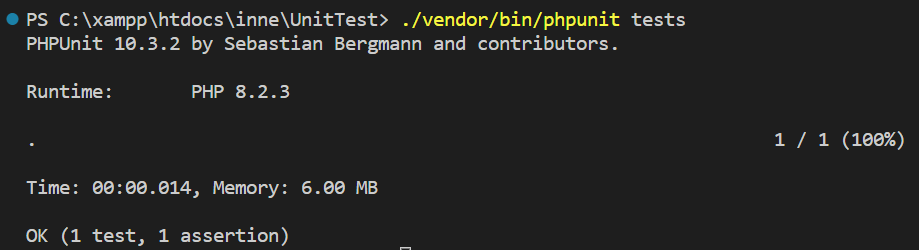
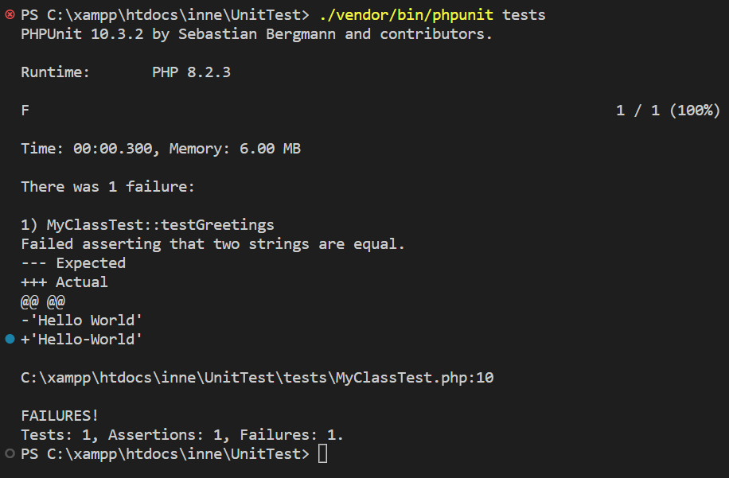
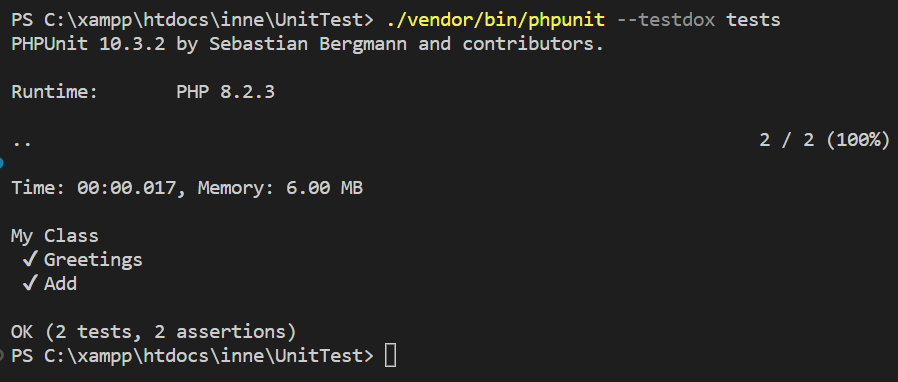
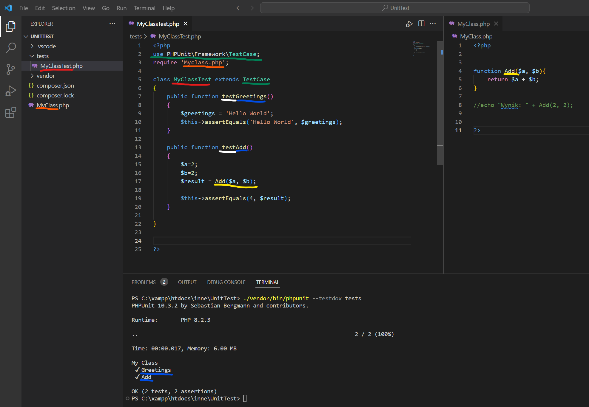

# web-development-course

`Jakub Piskorowski on 23/08/2023 wersja: 1.0`

## Temat: PHPUnit - Instalacja, pierwszy test

Instalacja fremeworka do testów jednostkowych w PHP.  
Pierwszy napisay test.

---

### PHPUnit

**PHPUnit to framework testów jednostkowych**, którego autorem jest Sebastian Bergmann. Jak inne tego typu frameworki **używa on do testów tzw. asercji,** które sprawdzają jak zachowuje się kod poddany testom (można spotkać się również z skrótem SUT – system under test). O idei samych testów jednostkowych możesz przeczytać w Wprowadzeniu do TDD w PHP. PHPUnit jest w pełni obiektowym narzędziem, które czerpie swoje rozwiązania z frameworków typu xUnit.

**Asercja** to zwyczajne sprawdzenie czy to co otrzymał dany fragment kodu jest tym czego się spodziewamy. Poniżej krótki fragment (wyjęty z kontektu, omówię go niżej):

``` php
$text = 'Hello World';
$this->assertTrue($text === 'Hello World');
```

W tym przypadku sprawdzamy czy wyrażenie porównania zwraca prawdę. Po napisaniu pierwszego testu sprawa na pewno się rozjaśni :).

## Instalacja PHPUnit

Na nasze potrzeby zainstalujemy PHPUnit lokalnie w danym projekcie, korzystając z Composera.

Uruchamiamy terminal (lub wiersz poleceń) w głównym folderze naszego projektu i wpisujemy:

``` bash
composer require --dev phpunit/phpunit
```

Po poprawnym zainstalowaniu możemy wpisać polecenie poniżej aby sprawdzić w jakiej wersji został zainstalowany framework. 

``` bash
./vendor/bin/phpunit --version
```

Źródło: [itcraftsman.pl](http://itcraftsman.pl/tdd-w-php-testy-jednostkowe-z-phpunit-krok-po-kroku/)

## Pierwszy test

Ok, nareszcie możemy przejść do napisania pierwszego testu. W głównym katalogu tworzymy nowy folder "tests" (może być dowolnie inny, pamiętaj tylko żeby zaktualizować odpowiednio tag directory w pliku phpunit.xml). Nasz pierwszy test będzie do bólu klasyczny. Tworzymy nowy plik "MyClassTest.php" z następującą zawartością:

``` php
<?php
use PHPUnit\Framework\TestCase;

class MyClassTest extends TestCase
{
    public function testGreetings()
    {
        $greetings = 'Hello World';
        $this->assertEquals('Hello World', $greetings);
    }
}
```

Objaśnimy teraz jego strukturę. **Nazwa pliku** oraz **nazwa klasy** pokrywa się, jednocześnie nazwa powinna wskazywać testowany obiekt i **kończyć się słowem Test** (np. UserTest lub RegisterEventTest). Każda testowana klasa powinna dziedziczyć po klasie **TestCase**. Zapewnia ona dostęp do wszystkich możliwych asercji, oraz paru innych przydatnych metod (m. in. setUp oraz tearDown). **Każda metoda** powinna testować jeden element (funkcjonalność) i być **poprzedzona słowem test** (np. testInstance lub testAddsNumbers).

Sprawdzimy teraz czy nasz test przechodzi. Wpisz w konsoli poniższe polecenie i sprawdź czy masz przed oczami coś podobnego.

``` bash
./vendor/bin/phpunit tests
```



Ostatnia linijka "OK" oznacza ona, że wszystkie testy przeszły (w ilości 1) oraz łącznie była jedna asercja. Nad linią z czasem i zabraną pamięcią, znajduje się pojedyncza kropka i nie jest przypadkowa. Reprezentuje ona pojedynczy test. Gdy dodamy kolejny, zobaczymy kolejnę kropkę (o ile się powiedzie). W przypadku gdy dany test zawiedzie, zamiast kropki wyświetli się litera F (od failure). Przykład poniżej:



Poniżej znajduje się alternatywny wynik testu, który opiera się na założeniu, że nazwa testu może służyć do dokumentowania zachowania testu. Dzięki temu widzimy dokładnie które testy przesły.

```bash
./vendor/bin/phpunit --testdox tests
```



W powyższym przykładzie mamy stworzone już dwie klasy testujące "testGreetings" oraz "testAdd". 

Aby przetestować metodę, która znajduje się w innym pliku (Myclass.php) należy najpierw ją dołączyć do naszych testów poleceniem `require 'Myclass.php';`. W naszym przypadku została stworzona funkcja `Add()`, która dodaje do siebie dwie wartości. Teraz aby przetestować działanie naszej funkcji należy już w pliku z naszymi testami stworzyć nową funkcje testującą. W niej na początku określić parametry wejściowe `$a=2;` oraz `$b=2;`. Kolejnym krokiem jest przetestowanie naszej funkcji `$result = Add($a, $b);` i zostaje już tylko sprawdzić czy otrzymaliśmy oczekiwany rezultat poleceniem `$this->assertEquals(4, $result);`. Poniżej znajduje się opisany kod. 

``` php
public function testAdd(){ 
    $a=2; 
    $b=2;
    $result = Add($a, $b);

    $this->assertEquals(4, $result);
}
```

Poniżej znajduje się pełna struktura projektu z testem:



