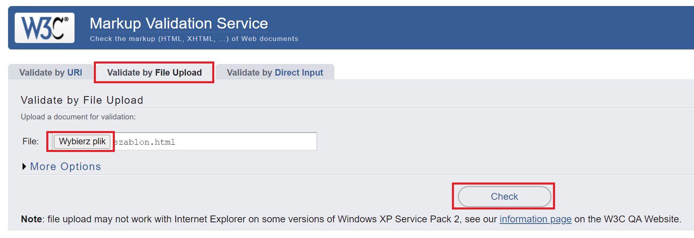
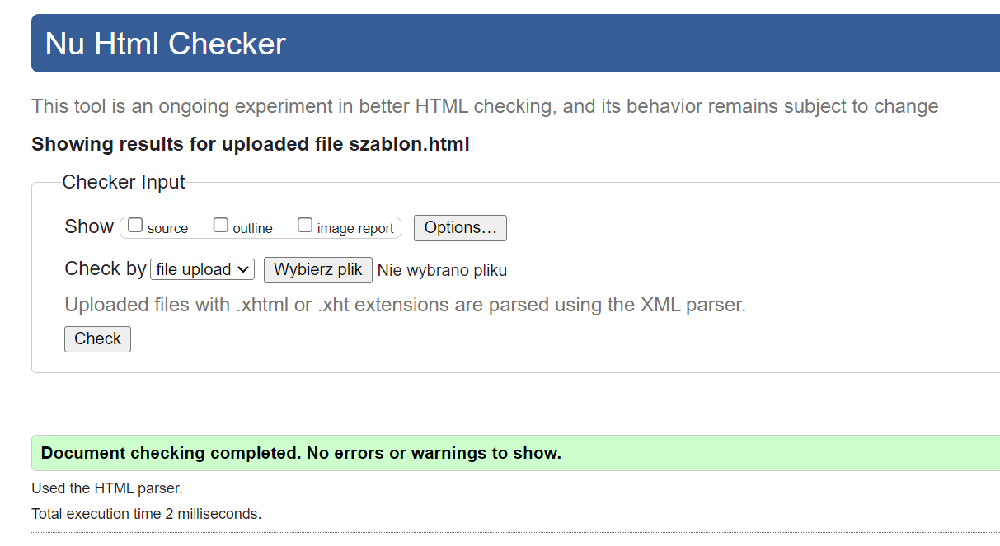

# web-development-course

`Jakub Piskorowski on 12/04/2023 wersja: 1.0`

## Temat: Walidacja i optymalizacja strony

Omówienie walidacji i optymalizacji strony.

--- 

## 1. Dlaczego te elementy są ważne dla funkcjonowania strony?

Walidacja i optymalizacja strony internetowej są kluczowe dla funkcjonowania strony i zadowolenia użytkowników. Poniżej wyjaśniam, dlaczego te elementy są ważne:
- **Walidacja strony** \
Walidacja strony polega na sprawdzeniu, czy kod źródłowy strony jest zgodny z określonymi standardami i specyfikacjami, takimi jak HTML, CSS czy JavaScript. Poprawność kodu jest kluczowa dla funkcjonowania strony i jej wyglądu. Błędy w kodzie źródłowym mogą skutkować m.in. niepoprawnym wyświetlaniem zawartości, problemami z dostępnością strony czy problemami z odczytywaniem treści przez roboty wyszukiwarek. Poprawnie zwalidowana strona ma większe szanse na sukces w internecie.
- **Optymalizacja strony** \
Optymalizacja strony polega na usprawnieniu jej działania, tak aby ładowała się szybciej i działała płynniej. Szybkość ładowania strony ma bezpośredni wpływ na jej pozycję w wynikach wyszukiwarek, a także na zadowolenie użytkowników. Im szybsze ładowanie strony, tym większa szansa, że użytkownik zostanie na niej dłużej i skorzysta z jej usług. Dłuższe czasy ładowania skutkują natomiast zniecierpliwieniem użytkowników i opuszczaniem strony. Optymalizacja strony obejmuje m.in. zmniejszenie rozmiaru plików, optymalizację obrazów, redukcję liczby zapytań do serwera, zastosowanie kompresji czy wykorzystanie pamięci cache.

Podsumowując, walidacja i optymalizacja strony są niezbędne dla poprawnego i skutecznego funkcjonowania strony internetowej. Poprawna walidacja strony i jej optymalizacja mają kluczowe znaczenie dla zadowolenia użytkowników, a także wpływają na jej pozycję w wynikach wyszukiwarek.

## 2. Walidacja strony

## 2.1 Znaczenie walidacji strony internetowej

Walidacja strony internetowej to proces sprawdzania, czy kod źródłowy strony jest zgodny z określonymi standardami, takimi jak HTML, CSS, czy JavaScript. Celem walidacji jest upewnienie się, że strona jest zgodna z normami i zaleceniami, co przyczynia się do poprawnego działania strony oraz zwiększa jej dostępność dla użytkowników.

Walidacja strony internetowej jest bardzo ważna, ponieważ pozwala uniknąć wielu problemów i zagrożeń związanych z funkcjonowaniem strony. Oto kilka korzyści związanych z walidacją strony:

1. **Poprawne działanie strony** – dzięki walidacji można upewnić się, że kod źródłowy strony jest poprawny i zgodny z normami, co przyczynia się do jej poprawnego działania.

2. **Zwiększenie dostępności** – walidacja strony sprawia, że jest ona bardziej dostępna dla różnych grup użytkowników, w tym dla osób z niepełnosprawnościami. Strona, która jest zgodna z normami, jest bardziej dostępna dla czytników ekranowych, a także dla użytkowników korzystających z różnych przeglądarek i urządzeń.

3. **Zwiększenie pozycji w wynikach wyszukiwarek** – strona, która jest zgodna z normami, ma większe szanse na wysoką pozycję w wynikach wyszukiwarek. Poprawna walidacja strony wpływa na jej wydajność i szybkość, co pozytywnie wpływa na jej pozycję w wynikach wyszukiwarek.

4. **Ułatwienie utrzymania strony** – walidacja strony ułatwia utrzymanie jej przez webmasterów, ponieważ pozwala szybciej i skuteczniej rozwiązywać problemy techniczne i zapewniając pełną zgodność z normami.

Podsumowując, walidacja strony internetowej jest niezbędna dla poprawnego i skutecznego funkcjonowania strony. Poprawna walidacja strony ma kluczowe znaczenie dla zadowolenia użytkowników, a także wpływa na jej pozycję w wynikach wyszukiwarek.

## 2.2 Przegląd W3C Markup Validation Service do walidacji strony

Walidator W3C to darmowe narzędzie on-line do badania stron internetowych. Ma istotny wpływ na sposób postrzegania strony przez roboty wyszukiwarek oraz na sposób wyświetlania witryny w obecnych i przyszłych przeglądarkach www. Narzędzie nie analizuje stron pod kątem standardu WCAG 2.0, ale ma wpływ na określenie jej dostępności. Pozwala sprawdzić zgodność dokumentu HTML ze standardami HTML lub XHTML. Za pomocą tego narzędzia możemy zweryfikować czy strona, którą zaprojektowaliśmy spełnia określone minimalne wymagania. Umożliwia programistom znalezienie błędów niezgodnych z ustalonymi założeniami przesyłu i pisania stron www. Oprócz tego serwis W3C oferuje szereg dodatkowych narzędzi, które pomogą zweryfikować inne rodzaje dokumentów, a także poprawić jakość stron internetowych.

Możemy walidować stronę dwa różne sposoby. Poprzez umieszczenie linku do strony, którą chcemy sprawdzić lub wrzucić bezpośrednio pliki do walidowania. Analiza rozpocznie się po kliknięciu przycisku "Check".

Link do strony: [validator.w3.org](https://validator.w3.org/#validate_by_upload)

Po przeprowadzonym badaniu, w górnej części, wyniki wyświetlają się niemal natychmiast. Użytkownik dowie się z nich ile błędów, ostrzeżeń lub ich brak wykazała analiza. Poniżej wyświetla się dokładna informacja na temat odnalezionych niezgodności. W pierwszej kolejności spis wykrytych błędów – error, a potem ostrzeżeń – warning. Określona zostanie ich dokładna lokalizacja w kodzie źródłowym witryny (kolumna i wiersz kodu) oraz szczegółowy opis odnalezionego problemu.

Zaletą narzędzia jest to, że jest udostępnione za darmo. Wadą zaś, możliwość sprawdzenia tylko jednej strony oraz język angielski i techniczne nazewnictwo, które trafia tylko do zaawansowanych użytkowników zajmujących się na codzień programowaniem.

Źródło: [pad.widzialni.org](https://pad.widzialni.org/index.php?p=new&idg=mg,13&id=544)

## 2.3 Najczęstsze błędy popełniane na stronach internetowych

Niekiedy nawet dobrze zaprojektowany przez agencję interaktywną serwis firmowy, w rękach szalonego marketing managera może się zamienić w nieefektywny bubel, który przynosi więcej strat, niż korzyści.

Jeżeli firmowa strona www jest pełna wad i niedociągnięć wpływa to na zły odbiór całego przedsiębiorstwa. Firma przedstawia się wtedy w złym świetle w oczach odwiedzających ją w Internecie. Pamiętaj, że najważniejszym celem firmowej witryny jest przekaz informacji w sposób prosty i zrozumiały dla potencjalnego klienta oraz umożliwienie mu kontaktu z Waszym działem handlowym. 

Najczęściej popełniane błędy na stronach firmowych to:

1. **Używanie wielu kolorów i krojów czcionek** \
Poprzez zastosowanie wielu kolorów i szerokiej gamy czcionek przekazywane treści mogą wprowadzić zamęt wtedy potencjalny odbiorca zostanie raczej odstraszony, niż zachęcony do dalszej eksploracji. Zadbaj o to, aby użyta czcionka była czytelna. Kolory tekstu powinny współgrać z jego tłem, aby nie męczyć oka. Zbyt mały kontrast między tłem, a kolorem czcionki to jawny zamach na nasze oczy. Przy bardziej istotnych informacjach można zastosować pogrubienie, bądź kursywę w celu skierowania uwagi na daną informację. Zarówno krój pisma, jak i jego nachylenie, wykorzystane w reklamie kolory i grafika, powinny ze sobą współgrać i potęgować zamierzony przez twórców efekt. Edytuj kolor i czcionkę kopiowanego tekstu zanim wkleisz go z innego źródła na swoją stronę tak, aby był jednolity.

2. **Brak określonego celu i funkcji jakie ma pełnić serwis** \
Celem każdej firmy jest jak największa liczba zadowolonych klientów. Nie wyznaczenie celu istnienia strony www może skutkować chaosem. Zamieszczane treści poprzez zły dobór i natłok zbędnych informacji mogą wprowadzać klientów w błąd. Myślenie strategiczne w biznesie ma tą zaletę, że uwalnia Cię od ciągłych zmian, natłoku obowiązków i pozwala na skupienie się na tym, by stale podnosić poziom korzyści, jakie klient widzi w Twoich produktach lub usługach. Zadaj sobie pytanie co chcesz osiągnąć poprzez prowadzenie strony swojej firmy i systematycznie realizuj założone cele. 

3. **Brak kontaktu na każdej podstronie** \
Potencjalny klient powinien mieć możliwość skontaktowania się z firmą w możliwie prosty sposób. Zakładka kontaktu powinna znajdować się na ostatnim miejscu w wymienianych pozycjach, ponieważ jest to intuicyjne. W informacjach kontaktowych należy zamieścić: nazwę firmy, dokładny adres, telefon kontaktowy, adres e-mail, numer konta oraz NIP. Można dodać mapkę dojazdową wraz ze zdjęciem obiektu firmowego. W prawym górnym rogu proponowane jest zamieszczenie formularza szybkiego kontaktu.

4. **Nieaktualne wpisy i publikacje** \
Publikowane treści powinny być aktualne i dodawane na bieżąco. W przypadku niesystematycznego aktualizowania strony klient może odebrać to jako porzucenie działalności. Wpisy powinny pojawiać się często, by uniknąć sytuacji kiedy klient odwiedza stronę w maju zastając życzenia Bożonarodzeniowe. Należy pamiętać także o weryfikowaniu zamieszczanych informacji kiedy ulegają one zmianie. 

5. **Przeładowanie strony widgetami** \
Mniej znaczy więcej także w tym przypadku. Strony internetowe powinny być przejrzyste, proste i czytelne. Odradzamy „ulepszania” wyglądu strony zbędnymi gadżetami. Unikaj zamieszczania na stronie zegara i kalendarza, każdy system operacyjny komputera posiada taki, klient ma go „pod ręką”, jest on więc zbędny w witrynie Twojej firmy. Imieniny, informacje pogodowe bądź nieużywany newsletter także zaśmiecą stronę www. Widżety wbrew pozorom mogą nie okazać się przydatne, możemy osiągnąć cel przeciwny do zamierzonego.

6. **Brak spójnego corporate identity** \
Częstym błędem podczas prowadzenia strony swojej firmy jest brak identyfikacji witryny z firmą. Stosowanie elementów graficznych często odbiega od przyjętych przez firmę elementów, znaków i barw przez co znacznie utrudnia identyfikacje firmy. Zaleca się stosowania elementów charakterystycznych dla swojej firmy. Styl firmy w wizytówkach, gadżetach, czy stronie www powinien być ten sam. Identyfikacja wizualna  to podstawowe narzędzie, służące kreowaniu wizerunku marki firmy na rynku.

7. **Zła nawigacja** \
Nawet jeśli treść strony będzie zrobiona w dobry sposób a nie będzie posiadała przestrzennej nawigacji. Musisz się postarać aby była czytelna i w krótkim czasie pozwoliła ci dostać się na dowolna podstronie. Postaraj się ja skonstruować tak aby każdy wiedział gdzie jest. Polecana jest zasada trzech kliknięć. Polega ona na tym, aby odwiedzający witrynę trzema kliknięciami doszedł do zamierzonej podstrony. Jest to optymalna liczba, ponieważ w przypadku kiedy należy wykonać sporą liczbę kliknięć klient może się zirytować i zgubić na stronie.

8. **Reklamy** \
Absolutnie każdy internauta wie, jakie to irytujące. W najlepsze przeglądasz strony internetowe, a nagle nie wiadomo skąd atakują Cię reklamy. Unikaj zamieszczania sporej ilości reklam w Twojej witrynie. Uciekający "krzyżyk", denerwujący dźwięk, wielkie na cały ekran. Wielu z odwiedzających Twoją stronę www może zrezygnować z dalszego korzystania z niej poprzez natłok wyskakujących reklam. Ogranicz występowanie reklam do minimum.

9. **"Martwe" social media** \
Linki do stron social media muszą być aktualne. Jeśli rezygnujesz z prowadzenia np. funpage na facebooku, profilu firmy na tweeterze czy też instagramie do którego umieszczony jest link w Twojej witrynie - usuń go. Nie zaniedbuj weryfikowania zmian. Niepotrzebne linki zaśmiecają tylko Twoją stronę www. Odradzamy jednak rezygnację ze stron social media. Poprzez aktywne prowadzenie fanpejdży jesteś w stanie najszybciej informować klientów o nowościach, co pozytywnie wpływa na wizerunek firmy.

10. **Trudna do zapamiętania domena** \
Zadbaj o to, aby Twoja domena była łatwa w zapamiętaniu. Unikaj wieloczłonowych nazw. Odpowiednia domena internetowa wpływa korzystnie na wizerunek firmy. Pozwala ona na zidentyfikowanie firmy z adresem strony www, wpływanie na pozycję w wyszukiwarkach - nazwa firmy w adresie domenowym pozwoli zdobyć dobrą pozycję w systemach wyszukiwawczych.

Źródło: [stronydlafirm.eu](https://www.stronydlafirm.eu/blog/wpis/15-najczestszych-bledow-popelnianych-na-stronach-internetowych-firm)

## 3. Optymalizacja strony

## 3.1 Znaczenia optymalizacji strony internetowej i korzyści z jej stosowania

Optymalizacja strony internetowej to proces polegający na zoptymalizowaniu jej kodu i zawartości w celu uzyskania jak najlepszej wydajności i szybkości ładowania. Optymalizacja strony jest bardzo ważna, ponieważ wpływa na doświadczenie użytkowników, a także na pozycję strony w wynikach wyszukiwarek.

Oto kilka korzyści związanych z optymalizacją strony internetowej:

- **Szybsze ładowanie strony** – zoptymalizowana strona ładowana jest szybciej, co przyczynia się do zwiększenia zadowolenia użytkowników oraz wpływa na jej pozycję w wynikach wyszukiwarek.
- **Poprawa doświadczenia użytkowników** – szybko działająca i łatwo dostępna strona pozytywnie wpływa na doświadczenie użytkowników, zwiększając ich zadowolenie i skłonność do powrotu na stronę.
- **Zwiększenie czasu przebywania na stronie** – szybko działająca i łatwo dostępna strona zachęca użytkowników do spędzania więcej czasu na jej przeglądaniu.
- **Zwiększenie konwersji** – zoptymalizowana strona ma większe szanse na zwiększenie konwersji, czyli na przekształcenie wizyt na stronie w rzeczywiste transakcje lub pożądane zachowania użytkowników.
- **Obniżenie kosztów** – zoptymalizowana strona wymaga mniej zasobów, co pozytywnie wpływa na koszty utrzymania strony.

Podsumowując, optymalizacja strony internetowej jest kluczowa dla zwiększenia zadowolenia użytkowników oraz pozycji strony w wynikach wyszukiwarek. Zoptymalizowana strona działa szybciej, zapewniając lepsze doświadczenie użytkowników oraz przyczyniając się do zwiększenia konwersji i obniżenia kosztów utrzymania strony.

## 3.2 "Google PageSpeed Insights" do optymalizacji strony

Narzędzie PageSpeed Insights (PSI) raportuje wrażenia użytkowników strony na urządzeniach mobilnych i komputerach oraz sugeruje sposoby jej ulepszenia.

**Dane dotyczące wrażeń użytkownika**

Dane dotyczące rzeczywistych użytkowników w PSI są oparte na zbiorze danych Raportu na temat użytkowania Chrome. PSI uwzględnia użytkowników w rzeczywistości: pierwsze wyrenderowanie treści (`FCP`), opóźnienie przy pierwszym działaniu (`FID`), największe wyrenderowanie treści (`LCP`) i skumulowane przesunięcie układu (`CLS`) w ciągu ostatnich 28 dni. PSI pokazuje też doświadczenia dotyczące wskaźników eksperymentalnych Interakcja z następnym (`INP`) i czas do pierwszego bajta (`TTFB`).

Aby wyświetlać dane o wygodzie użytkowników na danej stronie, musisz mieć wystarczającą ilość danych, aby uwzględnić je w zbiorze danych na temat użytkowania Chrome. Strona może nie mieć wystarczających danych, jeśli została niedawno opublikowana lub zawiera za mało próbek od rzeczywistych użytkowników. W tym przypadku PSI wróci do szczegółowości na poziomie źródła, co obejmuje wszystkie doświadczenia użytkowników na wszystkich stronach witryny. Czasami źródło może być niewystarczające, w takim przypadku PSI nie będzie w stanie pokazać żadnych danych dotyczących wrażeń użytkownika.

**Ocena jakości wrażeń**

PSI klasyfikuje jakość wrażeń użytkownika w 3 grupach: „Dobra”, „Wymagana poprawa” lub „Zła”. PSI ustawia następujące progi zgodnie z inicjatywą wskaźników internetowych:

|   | Dobrej jakości | Wymagana poprawa | Słaby | 
|---|---|---|---|
| FCP | 0 - 1800 ms | 1800 ms - 3000 ms | ponad 3000 ms |
| FID | 0 - 100 ms | 100 ms - 300 ms | ponad 300 ms |
| LCP | 0 - 2500 ms | 2500 ms - 4000 ms  | ponad 4000 ms |
| CLS | 0 - 0,1 | 0,1 - 0,25 | powyżej 0,25 |
| INP (ekstremalne) | 0 - 200 ms | 200 ms - 500 ms | ponad 500 ms |
| TTFB (ekstremalne) | 0 - 800 ms | 800 ms - 1800 ms | ponad 1800 ms |

**Rozkład i wybrane wartości danych**

PSI prezentuje rozkład tych danych, dzięki czemu programiści mogą zrozumieć zakres doświadczeń danej strony lub źródła. Rozkład danych jest podzielony na 3 kategorie: Dobra, Wymagana poprawa i Złe, na które składają się zielone, bursztynowe i czerwone paski. Na przykład bursztynowy pas na poziomie 11% wskazuje, że 11% wszystkich zaobserwowanych wartości LCP mieści się w przedziale od 2500 ms do 4000 ms.

Źródło: [developers.google.com](https://developers.google.com/speed/docs/insights/v5/about?hl=pl)

**Jak skorzystać z Google PageSpeed?**

- Aby przeprowadzić test szybkości strony Google, wprowadź żądany adres URL w witrynie [PageSpeed ​​Insights](https://pagespeed.web.dev/).

- Naciśnij Analizuj i pozwól PSI przeprowadzić analizę.
- Podczas generowania raportu narzędzie wykonuje dwie czynności: \
Najpierw gromadzi "dane terenowe" strony internetowej w CrUX, tj. raport Chrome User Experience. \
Następnie mierzy wydajność strony za pomocą API Lighthouse. Oblicza szybkość ładowania w kontrolowanym i symulowanym środowisku: urządzeniach średniej klasy i sieciach komórkowych. Dlatego jest to określane jako "dane laboratoryjne".
- Po sprawdzeniu raportu wyeliminuj zmienne utrudniające prędkość i obniż rankingi.

## 3.3 Najważniejsze czynniki wpływających na szybkość ładowania strony

Szybkość ładowania strony internetowej zależy od wielu czynników, w tym między innymi:

- **Rozmiar plików** – im większe pliki, tym dłużej trwa ich ładowanie. Dlatego ważne jest, aby jak najbardziej zminimalizować rozmiar plików na stronie, na przykład poprzez kompresję.
- **Optymalizacja obrazów** – obrazy stanowią często największy element na stronie, dlatego ich optymalizacja jest bardzo ważna. Można to zrobić między innymi poprzez zmniejszenie rozmiaru obrazów, stosowanie odpowiedniego formatu oraz kompresję.
- **Optymalizacja kodu** – kod strony powinien być napisany w sposób optymalny, tak aby działał jak najszybciej. Można to zrobić między innymi poprzez zminimalizowanie liczby zapytań do serwera, usunięcie zbędnych znaczników HTML i CSS, a także umieszczenie kodu JavaScript na końcu strony.
- **Wykorzystanie pamięci cache** – pamięć cache pozwala na przechowywanie plików strony na urządzeniu użytkownika, dzięki czemu strona może szybciej się ładować przy kolejnych wizytach.
- Wybór dobrego hostingu – szybkość ładowania strony zależy również od wydajności serwera, na którym jest ona hostowana. Dlatego warto wybrać dobrego dostawcę hostingowego.
- **Wykorzystanie Content Delivery Network (CDN)** – CDN to sieć serwerów rozproszonych na całym świecie, które przechowują kopie strony. Dzięki temu użytkownik łączący się z najbliższym serwerem CDN może ładować stronę szybciej.
- **Minimalizacja liczby wtyczek** – wtyczki mogą spowolnić ładowanie strony, dlatego warto minimalizować ich liczbę i wybierać te, które są naprawdę potrzebne.

Warto zwrócić uwagę na te czynniki i odpowiednio zoptymalizować stronę internetową, aby działała ona jak najszybciej i zapewniała użytkownikom najlepsze doświadczenie.

## Podsumowanie

Stosowanie walidacji i optymalizacji podczas tworzenia stron internetowych ma wiele korzyści dla użytkowników, właścicieli stron oraz samych twórców. Dlatego chciałbym zachęcić do ich stosowania.

Po pierwsze, walidacja pozwala na upewnienie się, że strona internetowa jest zgodna z obowiązującymi standardami i wytycznymi. Dzięki temu użytkownicy mają pewność, że strona działa poprawnie i jest bezpieczna w użytkowaniu. Walidacja również ułatwia utrzymanie strony, ponieważ wykrywa błędy w kodzie i pozwala na ich szybkie naprawienie.

Po drugie, optymalizacja strony internetowej pozwala na szybsze ładowanie się strony, co ma bardzo duże znaczenie dla użytkowników. Szybko ładująca się strona nie tylko poprawia doświadczenie użytkowników, ale również wpływa na pozycjonowanie strony w wynikach wyszukiwania. Im szybciej ładowana jest strona, tym wyższe jest prawdopodobieństwo, że użytkownicy będą na niej dłużej przebywać i wracać do niej w przyszłości.

Po trzecie, stosowanie walidacji i optymalizacji ma również korzyści finansowe dla właścicieli stron internetowych. Dzięki szybko ładowanej stronie internetowej można zwiększyć liczbę odwiedzin na stronie oraz przekonać użytkowników do dokonywania zakupów lub wykonywania innych działań na stronie, co przekłada się na większy zysk.

Wreszcie, stosowanie walidacji i optymalizacji kodu strony internetowej wpływa na pozytywny wizerunek twórców strony. Dzięki zastosowaniu najlepszych praktyk w projektowaniu stron internetowych, twórcy mogą przekonać użytkowników, że są profesjonalistami, którzy dbają o ich wygodę i bezpieczeństwo.

W związku z tym, zachęcam do stosowania walidacji i optymalizacji podczas tworzenia stron internetowych, aby poprawić doświadczenie użytkowników, zwiększyć liczbę odwiedzin na stronie i przekonać użytkowników do dokonywania zakupów lub wykonywania innych działań na stronie.
