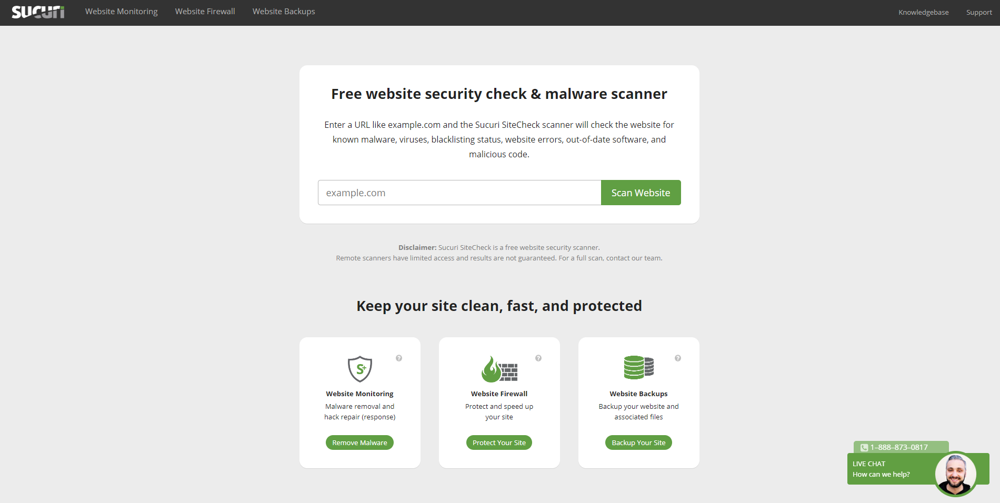
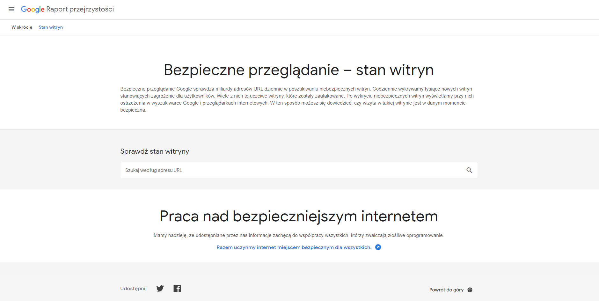
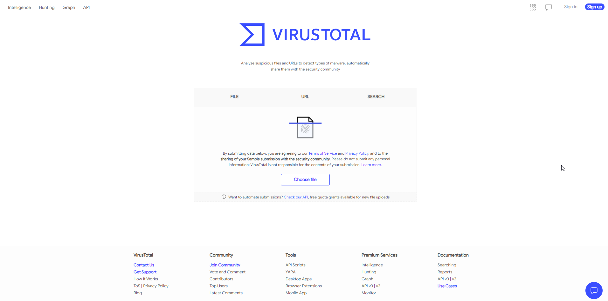

# web-development-course

`Jakub Piskorowski on 19/04/2023 wersja: 1.0`

## Temat: Zabezpieczanie witryny

Omówienie zagadnień zabezpieczania witryny 

--- 

## 1. Jak zadbać o bezpieczeństwo strony internetowej? 

Każdego dnia jesteśmy narażeni na niebezpieczeństwa, jakie niesie za sobą internet. W głównej mierze są to cyberataki na strony internetowe oraz prywatne urządzenia. Ich liczba wzrosła na przestrzeni kilku ostatnich lat. Dlatego każdy posiadacz strony www powinien zadbać o jej bezpieczeństwo. 

## 2. Rodzaje cyberataków - co nam grozi?

Cyberatak to **nielegalne działanie prowadzone w przestrzeni wirtualnej** i jednocześnie próba wykorzystania, zniszczenia lub uzyskania dostępu do cudzej strony, lub konta. Największym ułatwieniem dla hakerów jest posiadanie łatwej do penetracji i mało odpornej na atak sieci oraz niska świadomość użytkownika o potencjalnych zagrożeniach.

Wybuch światowej pandemii w 2020 roku przyczynił się do wzrostu ryzyka ich wystąpienia. W głównej mierze jest to spowodowane koniecznością organizacji pracy zdalnej w przypadku wielu firm, a co za tym idzie, zwiększeniem podatności na ataki hakerów.

Według raportu KPMG, w 2020 r., **aż 64% organizacji odnotowało przynajmniej jeden cyber incydent**, a w ¼ firm, mimo kryzysu spowodowanego pandemią, zwiększono wydatki na zapewnienie bezpieczeństwa. Jakich ataków powinniśmy się obawiać? Które z nich musimy znać, aby móc zadbać o bezpieczeństwo naszej strony internetowej?

- **Malware** - Najbardziej popularnym oprogramowaniem wśród hakerów jest malware. Wirus sprytnie przedostaje się do naszego systemu **z zainfekowanych stron internetowych, gier, pobranych plików, subskrypcji lub z poczty elektronicznej**. Najczęściej wykorzystywany jest do przechwycenia naszych haseł i danych osobowych, w celu wyrządzenia szkód finansowych firmy. \
Jeśli komputer działa bardzo wolno, zawiesza się, a przeglądarka zmieniła nagle stronę główną, można przypuszczać, że został on zainfekowany właśnie przez malware. Wyróżnia się kilka rodzajów tego wirusa, są nimi m.in: robaki, trojany, keyloggery, spyware czy adware. Bardzo mocno zagrażają one bezpieczeństwu naszej strony.

- **Phishing** - To kolejny sposób na wyłudzenie danych przez hakerów. Niczego nieświadomi użytkownicy zostają „złowieni na przynętę”, którą może być **SMS bądź e-mail od fałszywej organizacji lub firmy**, z której na co dzień korzystamy. Po kliknięciu w wysłany link odbiorcy proszeni są o podanie danych logowania. W ten prosty sposób hakerzy zostają posiadaczami informacji, które następnie wykorzystują m.in do kradzieży tożsamości, loginów czy haseł. \
Najbardziej podstępnym rodzajem phishingu jest tzw. spear-phishing, czyli **spersonalizowany atak na konkretnego odbiorcę**. W tym celu przestępcy początkowo zbierają dane o użytkowniku, takie jak jego zainteresowania, znajomi czy praca, następnie podszywają się pod znaną mu osobę lub partnera biznesowego i bezpośrednio kontaktują z nim w celu wymuszenia konkretnych działań, lub wyłudzenia informacji. Najczęściej do tego typu ataków hakerzy wykorzystują media społecznościowe takie jak Instagram czy Facebook, kontakt mailowy lub telefonują do poszkodowanego. 

- **Ransomware** - Oprogramowanie szantażujące mające na celu **wymuszenie okupu od użytkownika komputera**. Po uprzednim zaszyfrowaniu wszystkich danych przez hakera użytkownik informowany jest o możliwości ich odkupienia poprzez wpłacenie ustalonej kwoty. Ten zabieg celowany jest głównie w większe firmy, dla których utrata takich informacji może oznaczać poważne problemy. Jeśli kopie zapasowe nie są wykonywane regularnie, ransomware może doprowadzić do całkowitej utraty wszystkich danych.

- **Brute force attack** - Brute force attack, czyli atak siłowy, to technika łamania haseł, która polega na **sprawdzeniu wszystkich możliwych kombinacji z użyciem małych i wielkich liter, cyfr i znaków specjalnych**. Odkrycie krótkiego i łatwego hasła jest dla tego ataku bardzo łatwe.

- **Defacement** - Jest to atak, który powoduje **zepsucie witryny internetowej za pomocą zmiany wyglądu**. Tego rodzaju atak to najczęściej próba dokonania protestów na tle politycznym i religijnym, chęć rozpowszechniania obraźliwych wiadomości lub po prostu zniesławienia konkretnej osoby, organizacji czy firmy. Złośliwe informacje przenikają do witryny internetowej i zastępują jej zawartość własnymi treściami i grafikami. Szczególnie narażone są popularne i często odwiedzane strony.

- **DoS** - Atak DoS (Denial-of-Service, czyli odmowa dostępu) polega na zakłóceniu pracy serwera poprzez uniemożliwienie jego użytkownikom połączenie się z nim przez internet. Denial of Service działa na zasadzie **skierowania do serwera tak dużego ruchu, że sieć docelowa nie jest w stanie odpowiadać lub przestaje działać**. Jednym ze sposobów jest ciągłe wysyłanie określonych typów pakietów na adres IP atakowanego serwisu. W przeciwieństwie do innych ataków ten nie jest bardzo skomplikowany. Nie trzeba być doświadczonym hakerem, żeby go przeprowadzić.

## 3. Jakie szkody powodują cyberataki?

Nieodpowiednie zabezpieczenia mogą powodować nieodwracalne skutki. Dotyczy to przede wszystkim wiarygodności wśród odbiorców. Dlatego zadbanie o bezpieczeństwo strony internetowej jest tak ważne.

Poważnym zagrożeniem jest **kradzież danych osobowych**, w celu ich dalszego wykorzystania. Włamanie się na konto internetowe użytkownika może okazać się dla hakera żyłą złota. Wszystkie prywatne dane, takie jak np. konto bankowe, informacje podatkowe czy pesel, znajdują się w internecie. Wchodząc w ich posiadanie przestępca może ukraść cudzą tożsamość, wziąć wysoki kredyt, uzyskać dostęp do firmy, w której pracuje dana osoba lub po prostu sprzedać te dane dla zysku.

W przypadku strony internetowej należącej do przedsiębiorstwa cyberataki mogą zainfekować witrynę i zapełnić ją nieprzyzwoitą treścią. Tego typu działania mogą mieć wpływ na **reputację firmy**. Dla użytkowników raz zainfekowana strona stanie się niebezpieczna, co w następstwie **może zniechęcić ich do jej ponownego odwiedzenia**. Dlatego bezpieczna strona to konieczność.

Zhakowana witryna może wykonywać szereg nielegalnych działań, czego skutkiem może być **nałożenie kar administracyjnych na właściciela strony**. Jednak największym zagrożeniem jest utrata danych poufnych korporacji, co w następstwie może prowadzić nawet do upadku firmy.

## 4. Jak zabezpieczyć stronę przed atakami hakerów?

Jako że cyberataki są bardzo powszechne, a nawet nieuniknione, firmy oraz osoby prywatne obowiązkowo powinny zabezpieczyć przed nimi swoją witrynę. Zdobycie wiedzy na temat potencjalnych zagrożeń jest pierwszym krokiem do zmniejszenia ryzyka ataku. Następnym jest skorzystanie z dostępnych zabezpieczeń. 

### Certyfikat SSL

**SSL** (Secure Sockets Layer) to obowiązkowy i podstawowy element ochrony. Pozwala on na szyfrowanie przesyłanych informacji między stroną internetową a użytkownikiem.
 
Stronę z takim certyfikatem rozpoznamy po **małej kłódce widocznej przed adresem strony www**. Dzięki SSL nikt z zewnątrz nie będzie mógł wejść w posiadanie danych poufnych. Wdrożenie tego certyfikatu zapewni klientów o bezpieczeństwie strony i dzięki niemu zaczną darzyć ją większym zaufaniem. Oprócz tego posiadanie certyfikatu SSL wpłynie na **lepsze pozycjonowanie w wyszukiwaniach Google**. Warto zaznaczyć, że najnowsze przeglądarki od razu wyświetlają użytkownikom ostrzeżenie o niezabezpieczonej stronie, co może zniechęcić do jej odwiedzania. Przyjrzyjmy się, jak wygląda proces przesyłania informacji za pomocą certyfikatu SSL.

Po pierwsze konieczne jest potwierdzenie tożsamości użytkownika. Następnie kopia protokołu SSL trafia z serwera do przeglądarki, która weryfikuje źródło i ważność certyfikatu oraz odsyła informację z powrotem. Z kolei przez serwer wysyłane jest potwierdzenie, które pozwala na rozpoczęcie szyfrowanej sesji. Skutkiem tego jest przesyłanie zabezpieczonych informacji między nimi.

Na rynku znajdziemy **firmy oferujące zarówno płatne, jak i bezpłatne certyfikaty**. Ich dostawcy muszą zostać potwierdzeni przez **CA Security Council**. Najpopularniejsi z nich to: Domain, Comodo czy Digicert. Darmowy certyfikat założymy na stronie Let’s Encrypt lub Cloudflare.

Do **najprostszego i najbardziej popularnego certyfikatu** należy DV (Domain Validation). W tym wypadku potrzebujemy jedynie witryny zarejestrowanej na danych firmowych oraz powiązanego z nią adresu e-mail.

Kolejnym jest OV (Organization Validation). Tutaj konieczne jest **potwierdzenie danych** w celu zweryfikowania działalności. Potrzebny też będzie skan dowodu oraz dokumenty firmy.

Ostatnim jest EV (Extended Validation), który **kosztuje trochę więcej**, lecz **wyróżniony** jest w przeglądarce dodatkowym polem, na którym **obok kłódki wyświetla się pełna nazwa firmy**. Aby go uzyskać, konieczne jest również potwierdzenie naszych danych w organizacji zewnętrznej, zajmującej się weryfikacją tego rodzaju danych. Certyfikat EV jest konieczny w przypadku prowadzenia stron bankowych, czy państwowych.

### Używanie tylko skomplikowanych haseł

Bezpieczna strona internetowa potrzebuje bezpiecznego hasła i loginu. Jeśli znajduje się na niej panel administracyjny, konieczne będzie użycie skomplikowanych kombinacji. Proste i krótkie dane, będą dla hakerów idealną okazją do zhakowania. 

### Aktualizowanie komponentów strony

W kwestii bezpieczeństwa stron, stworzonych w oparciu o **WordPressa**, konieczne będzie **regularne aktualizowanie wszystkich komponentów witryny**. Popularność narzędzia oraz wiedza hakerów o jego słabych stronach spowodowała, że witryny **stworzone w WordPress często padają ofiarą cyberprzestępców**. Wszystkie **nieaktualne rozszerzenia, wtyczki oraz motywy posiadają znane przez hakerów luki** i są idealną okazją dla cyberataku. Warto zaopatrywać się w dodatkowe funkcje jedynie u zaufanych dostawców i nigdy nie instalować rozszerzeń pochodzących z niesprawdzonego źródła.

W przypadku każdej nawet najmniejszej aktualizacji elementów strony należy **pamiętać o kopii zapasowej**. Dzięki temu szybko i sprawnie przywrócimy jej poprzedni stan w razie ewentualnej awarii.

## Wtyczki lub komponenty do ochrony witryny

W sieci znajdziemy przeróżne wtyczki i dodatki do stron internetowych mające zapewnić ich bezpieczeństwo. Jednak w tym wypadku warto być ostrożnym. Dobierając wtyczkę musimy liczyć się z tym, że **nie będzie ona całkowicie darmowa**. Profesjonalny i bezpieczny dodatek do naszej witryny wiąże się z kosztami, natomiast **wiele pirackich stron oferuje nam darmowe narzędzia**. Jednak czy będą one dla nas bezpieczne?

Takie wtyczki niejednokrotnie mają zmodyfikowany kod. Zatem zdecydowanie bezpieczniej i opłacalniej będzie wykupić dodatek u sprawdzonego dostawcy, niż ponosić koszty za odwirusowanie strony internetowej. 

Najbardziej znanymi narzędziami do ochrony strony internetowej są: 

- **Sucuri Security** - dostępny w wersji płatnej i bezpłatnej. Program natychmiast informuje mailowo o każdym potencjalnym zagrożeniu oraz o wszystkich nieudanych próbach logowania. Skaner złośliwego oprogramowania sprawdzi też, czy ktoś nieupoważniony nie modyfikuje zawartości strony.

- **All in One WP Security and Firewall** - to tu znajdziemy wszystkie funkcje dotyczące ochrony stron stworzonych w WordPressie. Zawiera filtry antyspamowe i ochronę przed kopiowaniem. Dba o to by strony internetowe były bezpieczne. 

- **iThemes Security Pro** - wtyczka, która usuwa wszystkie luki w witrynie oraz zapewnia autoryzację dwukierunkową wysyłając hasło na telefon komórkowy użytkownika, podczas pierwszej próby logowania. Dzięki niej wygenerujemy też silne i skomplikowane loginy i hasła, dzięki czemu nasza strona będzie bardziej bezpieczna

## Bezpieczny i sprawdzony hosting

Bezpieczeństwo stron internetowych w głównej mierze zależne jest od dobrego hostingu. Dlatego jego dostawca musi być rzetelny i wiarygodny. Aby to sprawdzić, przy wyborze odpowiedniego hostingu powinniśmy zwrócić uwagę na kilka aspektów.

Pierwszym z nim jest **dostępność** (tzw. uptime). Jest to parametr informujący o awariach u danego dostawcy hostingu, które mogą powodować zakłócenia podczas działania strony. Z tego powodu bezpieczne serwery są bardzo ważne.

Firma powinna posiadać wskaźnik **SLA na poziomie minimum 99,5%** - inaczej usługa nie spełni wszystkich Twoich potrzeb. Wysoki wynik to gwarancja nieprzerwanego dostępu do witryny. Kolejną rzeczą jest sprawdzenie, czy dany hosting używa aktualnej wersji PHP oraz bazy danych MySQL.

Starsze warianty mogą być narażone na różnego typu zagrożenia. Warto odpuścić sobie korzystanie ze współdzielonego hostingu. Bardzo często zasoby jednego komputera są dzielone między kilkudziesięciu klientów. Skutkiem tego są limity nałożone na poszczególne strony w celu uniknięcia spowolnienia maszyny. Dlatego najlepszym rozwiązaniem będzie **skorzystanie z serwera prywatnego, jakim jest VPS**.

## Usuwanie starych komponentów

Warto utrzymywać porządek na stronie i na bieżąco **usuwać stare wtyczki i dodatki**, które nie są już wykorzystywane. To samo dotyczy odinstalowanych komponentów. Należy upewnić się, że proces deinstalacji został w pełni zakończony i nie zostały po nim żadne pozostałości. Tego typu elementy, mogą mieć luki oraz stać się przynętą dla cyberataków.

## Jak sprawdzić, czy strona nie ma wirusów i czy jest bezpieczna?

Odwiedzający stronę użytkownicy bardzo często dowiedzą się o jej zawirusowaniu dzięki **komunikatowi w przeglądarce internetowej** lub sygnałowi ze swojego **programu antywirusowego**. Po takiej informacji klient się zniechęca i może stracić zainteresowanie naszymi usługami. Dlatego warto upewnić się, czy nasza strona nie ma wirusów, szczególnie w przypadku, kiedy nie korzystaliśmy wcześniej z żadnych zabezpieczeń. Jak sprawdzić, czy strona internetowa jest bezpieczna?

W sieci możemy natknąć się na **narzędzia online skanujące strony internetowe** i wychwytujące wirusy. Jednak nie są one w 100% skuteczne. Skanują jedynie kod strony i nie mają dostępu do plików czy bazy danych, gdzie głównie znajduje się wirus. Jednak w przypadku popularnych i niegroźnych cyberataków są w stanie powiadomić o  przypuszczeniu zainfekowania strony i mogą pomóc zadbać o bezpieczeństwo strony www.

## Sucuri SiteCheck

Jednym z najbardziej popularnych skanerów antywirusowych dla stron internetowych jest Sucuri SiteCheck. Po wpisaniu adresu strony otrzymamy pełny raport na temat wszystkich potencjalnych zagrożeń. Dowiemy się też, czy nasza strona znajduje się na czarnych listach. Jednak nie poznamy w nim dokładnej lokalizacji wirusa. Program poinformuje jedynie o jego obecności. To narzędzie doskonale wie jak zadbać o bezpieczne strony internetowe. 

## Google Safe Browsing

Skaner od Google w kwestii bezpieczeństwa stron internetowych, sprawdza się całkiem dobrze. Pozwala sprawdzić, czy wpisany adres URL jest oznaczony jako "bezpieczny do odwiedzenia" przez wyszukiwarkę Google. To narzędzie monitoruje miliardy linków i, w razie podejrzeń, od razu oznacza je jako „niebezpieczne”. Według danych podawanych przez Google codziennie wykrywanych jest tysiąc witryn stanowiących zagrożenie dla użytkowników.

## Virus Total

Kolejnym znanym narzędziem ważnym dla bezpieczeństwa strony internetowej jest Virus Total. Analizuje on podejrzane pliki i adresy URL oraz umożliwia wykrycie wirusów, robaków, trojanów i innych szkodliwych programów typu malware. Ten skaner sprawdza wpisaną witrynę w oparciu o bazy danych wirusów z aplikacji antywirusowych, a następnie przedstawia konkretny raport.

## Jak usunąć wirusa ze strony internetowej?

W przypadku, kiedy nasza strona www została zainfekowana, do wyboru jest kilka rozwiązań. Najszybszym i najłatwiejszym sposobem na to, aby nasza strona była znowu bezpieczna, jest **zatrudnienie specjalisty, lub dedykowanej firmy**, jednak wiązać się to będzie z dużymi kosztami. Zanim do tego przystąpimy, warto spróbować zrobić to własnoręcznie. Zatem **jak usunąć wirusa ze strony internetowej** i tym samym poprawić jej bezpieczeństwo?

W tym celu należy upewnić się, czy obecny program antywirusowy jest aktywny, a następnie stworzyć kopię bezpieczeństwa. Konieczne jest **wyizolowanie backupu strony do zewnętrznego nośnika** (dysku zewnętrznego bądź pendrive'a), w razie jakichkolwiek niepowodzeń. Od razu po tym należy przystąpić do zmiany wszystkich możliwych loginów i haseł. Jeśli posiadamy kopię zapasową, warto przywrócić jej niezainfekowaną wersję.

W przypadku CMS należy przejrzeć wszystkie pliki szablonów, w szczególności zwracając uwagę na header.php oraz footer.php i porównać oryginalne pliki z plikami na swoim serwerze. Nie zaszkodzi też dokonać skanu komputera. Mało prawdopodobne, ale jednak możliwe jest, że to właśnie on stał się powodem zainfekowania strony www.

W przypadku usunięcia wirusa ostatnim krokiem jest **odblokowanie strony z tzw. czarnych list** różnych programów wirusowych. Jeśli natomiast podane działania nie wystarczyły i strona nadal jest zainfekowana, należy niezwłocznie zgłosić się do specjalisty w celu usunięcia zagrożenia i przywrócenia bezpieczeństwa naszej stronie. 

## Podsumowanie

**Bezpieczna strona internetowa to podstawa**. Mając na uwadze zagrożenia, jakie mogą spotkać użytkowników w sieci, należy zawsze kontrolować poziom zagrożenia. Niezabezpieczone witryny są idealną okazją dla hakerów, a skutki jakie mogą powstać w wyniku cyberataków często są ogromne. Warto im zapobiegać i stosować się do powyższych wskazówek. Bezpieczna strona internetowa, może temu zaradzić. 

Konieczne jest **stałe monitorowanie stanu bezpieczeństwa strony www** oraz jej **ciągłe skanowanie w poszukiwaniu zagrożeń**. W tym celu warto skorzystać z podanych wyżej narzędzi lub stworzyć stronę w kreatorze które to zagwarantuje. Obecnie liczba ataków przez cyberprzestępców cały czas rośnie. Najlepszym sposobem, aby się przed nimi obronić, jest ich świadomość oraz zachowanie rozsądku. To, że zagrożenie nie jest widoczne gołym okiem, nie znaczy, że nie istnieje. 

W przypadku korzystania z kreatora do tworzenia stron internetowych warto dowiedzieć się, w jakim stopniu będzie chroniona nasza strona internetowa.

Źródło: [webwavecms.com](https://webwavecms.com/blog/bezpieczenstwo-strony-internetowej)

