# web-development-course

`Jakub Piskorowski on 21/04/2023 wersja: 1.0`

## Temat: Monitorowanie ruchu na stronie

Omówienie zagadnień związanych z monitorowaniem ruchu na stronie www.

--- 

**Jednym z wyznaczników skuteczności działań SEO jest analiza ruchu na stronie**. By pozyskać dane w tym zakresie, można wykorzystać zarówno darmowe, jak i płatne narzędzia SEO, które generują podstawowe lub bardziej zaanwansowane i szczegółowe dane dotyczące liczby użytkowników i widoczności witryny. Jak sprawdzić ruch na stronie, w jakim celu to robić i jakie narzędzia w tym celu wykorzystać?

## Ruch na stronie - co to jest i dlaczego warto go analizować?

**Ruch na stronie według Google Analytics** to liczba użytkowników, która odwiedziła naszą stronę czy sklep internetowy w określonym czasie. Ponieważ analityczne narzędzia SEO nie mają dostępu do danych z Google Analytics, w ich przypadku ruch (czasem określany jako widoczność) definiowany jest jako potencjał słów kluczowych, na które jest widoczna konkretna witryna, do generowania ruchu. **Dokładne dane w zakresie ruchu uzyskamy zatem jedynie na własnej stronie w Google Analytics**. Analiza konkurencyjnych witryn pod kątem ruchu ma charakter szacunkowy. Mimo to może być jednak cenną wskazówką do rozwoju i optymalizacji działań marketingowych w sieci.

Dlaczego powinieneś analizować ruch na swojej stronie oraz na stronach konkurentów? Ponieważ dzięki danym:
- sprawdzisz, czy Twoja strategia marketingowa przynosi oczekiwane efekty,
- lepiej poznasz użytkowników i ich preferencje oraz oczekiwania, 
- możesz wdrożyć dokładne targetowanie reklam i dopasowywać działania do indywidualnych oczekiwań Twoich klientów,
- zweryfikujesz, czy ruch na stronie jest wartościowy i czy generuje konwersje - na stronie może być duży ruch, który jednak nie generuje konwersji, a Ty nie zarabiasz,
- dowiesz się, jakie frazy kluczowe generują ruch u konkurencji,
- rozwiniesz swoją strategię marketingową i poprawić statystyki ruchu,
pozyskasz nowych użytkowników i zwiększysz ruch na stronie.

## Jakie narzędzia wybrać do analizy ruchu na stronie?

Nie wiesz, jak sprawdzić ruch na stronie i jak wykorzystać pozyskane dane? Poznaj narzędzia, które polecamy jako agencja widoczni do analizy ruchu w witrynie. Wśród nich znajdują się:
- darmowe narzędzia Google: **Google Analytics** i **Google Search Console** do analizy ruchu na Twojej stronie,
- **SENUTO**, **SEMSTORM** i **Ahrefs** do analizy szacowanego ruchu na stronach konkurentów.

## Analiza ruchu na Twojej stronie - wykorzystaj narzędzie Google Analytics

Google Analytics to podstawowe, ale bardzo rozbudowane narzędzie do kompleksowej analizy Twojej strony pod kątem ruchu oraz użytkowników i ich zachowań. Dzięki umieszczeniu na stronie specjalnego kodu śledzenia wszystkie odwiedziny użytkowników są zapisywane w narzędziu i analizowane pod względem różnych aspektów. Analizę ruchu na stronie znajdziesz w narzędziu w różnych raportach:

- **Czas rzeczywisty** - raport prezentuje dane o ruchu w konkretnym momencie,
- **Odbiorcy** - raport pokazuje rozbudowane dane o odbiorcach i generowanym przez nich ruchu (m.in. struktura płci, wieku, struktura demograficzna, urządzenia i przeglądarki, z których korzystają użytkownicy),
- **Pozyskiwanie** - raport o źródłach ruchu na stronie, czyli skąd użytkownicy trafiają do Twojej witryny,
- **Zachowania** - raport pokazuje dane z analizy ruchu użytkowników na stronie (ile czasu średnio użytkownicy na niej spędzają, jakie podstrony odwiedzają, czy korzystają z wyszukiwarki w witrynie),
- **Konwersje** - raport analizuje wartość i jakość ruchu - ile konwersji generuje ruchu, jaki jest współczynnik odrzuceń i ile odwiedzin strony zakończyło się realizacją celu.

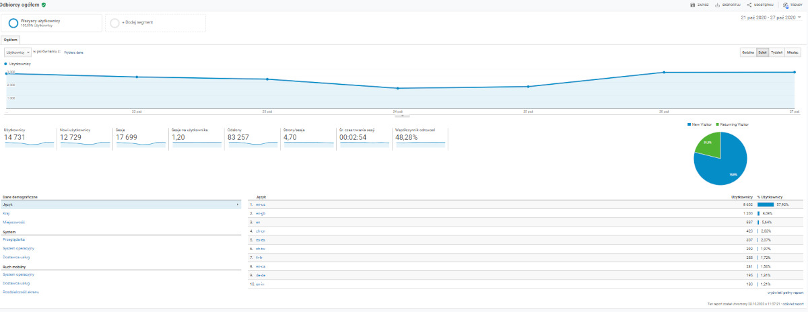

## Jak sprawdzić ruch na stronie w czasie rzeczywistym?

Chcesz wiedzieć, jaki jest ruch na stronie w konkretnym momencie? Skorzystaj z raportu "Czas rzeczywisty" w Google Analytics. Dzięki niemu dowiesz się:

- jaki ruch występuje na stronie w danym momencie i ilu użytkowników przegląda witrynę oraz jakie podstrony odwiedzają,
- czy niedawno zaktualizowane podstrony są odwiedzane przez użytkowników
- czy płatne kampanie reklamowe Google Ads generują ruch,
- czy udostępnione treści w mediach społecznościowych wpływają na wzrost ruchu na stronie.

W zakładce "Czas rzeczywisty" możesz także sprawdzić, czy wdrożony kod śledzenia faktycznie zbiera i analizuje interesujące Cię dane o ruchu w witrynie.

## Szczegółowa analiza ruchu na stronie internetowej w raporcie “Odbiorcy” w Google Analytics?

Google Analytics prezentuje rozbudowane dane o użytkownikach i ruchu, który generują oni na stronie. W narzędziu, w raporcie "Odbiorcy", możesz sprawdzić:

- jaka jest struktura płci użytkowników - **czy większy ruch pochodzi od kobiet, czy mężczyzn?**
- **jaka jest struktura wiekowa Twoich odbiorców** i którzy użytkownicy generują największy ruch,
- w jakiej lokalizacji Twoja strona lub sklep internetowy są najbardziej popularne,
- **jaki ruch generują nowi użytkownicy, a jaki powracający**,
- **z jakiej przeglądarki, systemu operacyjnego i urządzenia korzystają użytkownicy** generujący ruch na stronie - czy większość ruchu pochodzi z urządzeń stacjonarnych, czy mobilnych? Takie dane pozwolą Ci odpowiednio zoptymalizować strukturę i wygląd witryny w zależności od dominującej technologii.

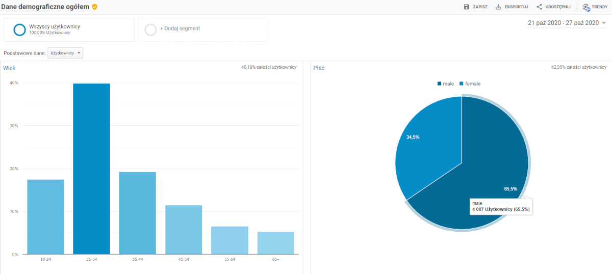

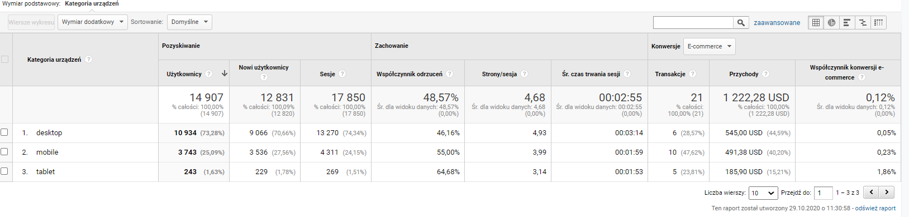

## Monitorowanie źródeł ruchu w raporcie "Pozyskiwanie" Google Analytics

Narzędzie Google Analytics zawiera także raport "Pozyskiwanie", w którym **możesz przeanalizować źródła ruchu w Twojej witrynie, czyli sprawdzić, jakie kanały generują największy ruch** i które działania marketingowe przynoszą oczekiwane efekty. W raporcie “Pozyskiwanie” znajdziesz następujące źródła ruchu:

- **Direct**, czyli co do zasady wejścia bezpośrednie, które następują poprzez wpisanie przez użytkownika adresu strony w pasku wyszukiwania - taki ruch na stronie generują najczęściej użytkownicy powracający na Twoją stronę, którzy już znają Twoją ofertę. W tym kanale Google Analytics uwzględnia także ruch, którego źródła nie rozpoznaje - np. linki znajdujące się w e-mailach, plikach PDF, a także linki skrócone w narzędziach.
- **Organic Search** - ruch generowany przez kliknięcia w bezpłatnych wynikach wyszukiwania.
- **Social** - ruch generowany przez kliknięcia w mediach społecznościowych (Facebook, Twitter, Google+ itp.);
- **Paid Search** - ruch generowany przez kliknięcia w płatne reklamy w wynikach wyszukiwania.
- **Display** - czyli ruch z reklam w sieci reklamowej (nie tylko Google, ale także Bing i innych wyszukiwarkach),
- **Referral** - ruch odsyłający - jest to ruch generowany przez kliknięcia użytkowników w odnośnik do naszej witryny zamieszczony na innej stronie.
- **Other** - w tym źródle może się znaleźć także ruch z Facebooka.

W zakładce "źródło/medium" w raporcie "Pozyskiwanie" możesz sprawdzić ruch na stronie w sposób bardziej szczegółowy. Dowiesz się m.in., z jakich domen pochodzi ruch - najbardziej pożądanym zjawiskiem jest dominacja ruchu z wyszukiwarki Google.

**Analiza źródeł ruchu na stronie umożliwi Ci weryfikację skuteczności działań marketingowych w poszczególnych kanałach** i zintensyfikowanie lub poprawę działań w tych kanałach reklamowych, na których najbardziej Ci zależy.

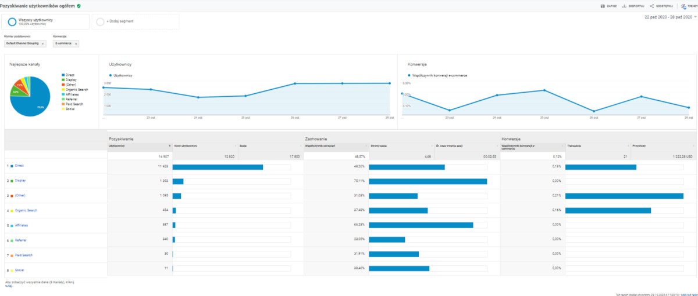

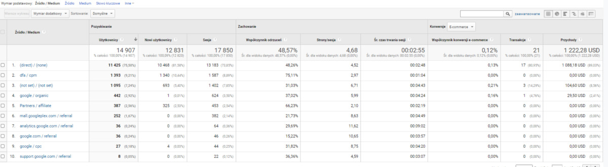

## Jak sprawdzisz ruch wewnątrz witryny?

W raporcie "Zachowania" znajdziesz dane dotyczące **zachowań użytkowników generujących ruch na stronie**. Dzięki niemu dowiesz się:

- jakie działania na Twojej stronie podejmują użytkownicy,
jak długo użytkownicy przebywają na stronie,
- jakie podstrony generują największy ruch i są najchętniej i najczęściej odwiedzane przez użytkowników,
- czy użytkownicy tworzący ruch odtwarzają materiały multimedialne, klikają w przyciski CTR,
- z jakiego miejsca użytkownicy opuszczają Twoją stronę,
- jaki jest współczynnik odrzuceń, czyli jaki procent użytkowników opuścił stronę od razu po odwiedzeniu strony wejścia, bez wykonania jakiegokolwiek działania.

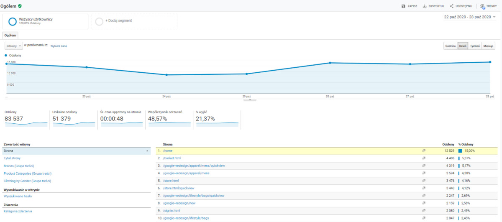

Ciekawym elementem raportu "Zachowania" jest zakładka **"Zmiany w zachowaniu", w której możemy sprawdzić ruch na stronie poprzez prześledzenie, jakie podstrony odwiedzali użytkownicy po kolei**, z jakich podstron wychodzili z naszej witryny, a także na jakie strony trafiali w pierwszej kolejności.

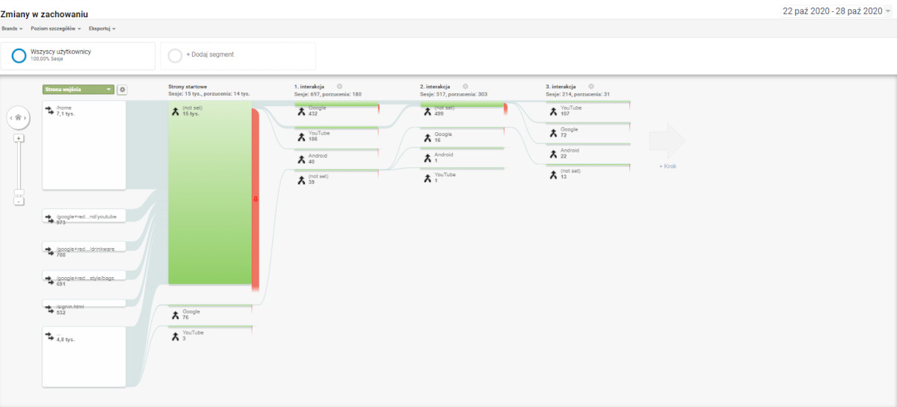

## Jak sprawdzić, czy ruch na stronie generuje przychody? Raport konwersji w Google Analytics

Raport "Konwersje" w Google Analytics umożliwi sprawdzenie, czy ruch w witrynie jest wartościowy, czyli czy przyczynia się do wzrostu przychodów. Sprawdzisz w nim:

- z jakiej strony następuje realizacja celu (dokonanie zakupu, zapis do newslettera, kontakt poprzez formularz kontaktowy),
- które podstrony wspierają konwersje (w zakładce "Ścieżki wielokanałowe"),
- jakie podstrony widział użytkownik przed realizację konwersji (celu),
- jaką liczbę i wartość konwersji przyniósł ruch w witrynie.

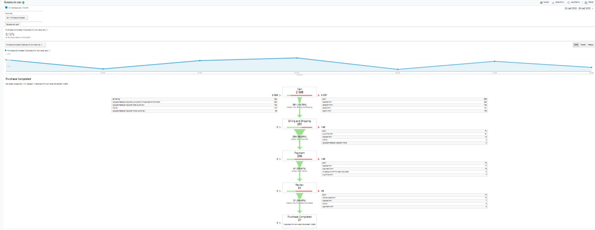

Źródło: [widoczni.com](https://widoczni.com/blog/jak-sprawdzic-ruch-na-stronie/)

---

## Jak zacząć korzystać z Google Analytics? Konfiguracja konta. 

Aby mierzyć ruch w witrynie, musisz **najpierw utworzyć konto Google Analytics.** Następnie **umieść na każdej stronie witryny mały fragment kodu pomiarowego JavaScriptu.** Za każdym razem, gdy użytkownik odwiedza stronę internetową, kod śledzenia zbiera anonimowe informacje o jego interakcji ze stroną.

Kod pomiarowy zbiera też informacje dotyczące przeglądarki, takie jak ustawienie języka, typ przeglądarki (np. Chrome lub Safari) oraz używane urządzenie i system operacyjny. Może nawet zbierać dane na temat „źródła wizyt”, czyli pokazać, skąd użytkownicy trafili do witryny. Źródłem wizyt może być wyszukiwarka, kliknięta reklama lub kampania marketingu e-mailowego.

Źródło: [support.google.com](https://support.google.com/analytics/answer/12159447?hl=pl)

## 1. Uprawnienia w Google Analytics i udzielanie dostępu do konta

**Jeśli konto Google Analytics zakładała dla Ciebie firma zewnętrzna**, zadbaj o to, by **przekazała Ci pełny dostęp** do konta. Na tym etapie dochodzi do zaniedbań, co skutkuje utratą dostępu do własnego konta. Nie zgadzaj się na udostępnianie Ci widoku Google Analytics do wglądu, Tobie potrzebne jest przejęcie własności konta. Natomiast osobie, która zakładała Ci konto dostępy już mogą nie być potrzebne, wtedy takiej osobie odbierasz uprawnienia.

Uprawnieniami zarządzamy w panelu administracyjnym (ikona koła zębatego w lewym dolnym rogu GA). Po wejściu w "Zarządzanie użytkownikami" otrzymujemy listę osób, które mają dostęp do naszego konta Google Analytics wraz z informacją jaki jest to dostęp.

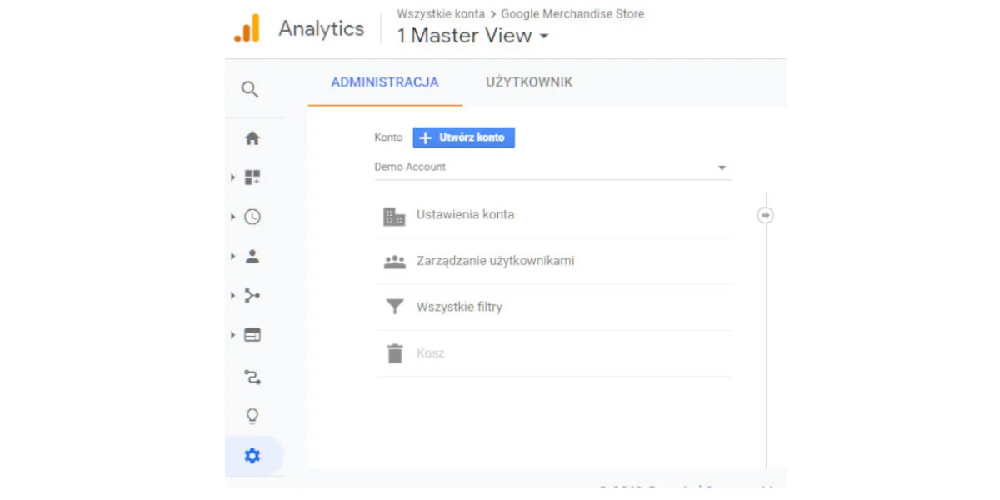

Jeśli chcemy udzielić dostępu do konta Google Analytics, klikamy w niebieską ikonkę + i podajemy adres mailowy osoby, której chcemy dać dostęp - musi to być adres, którym można zalogować się w Google (gmail, onet, wp itp.). Następnie **powinniśmy zdecydować jak szerokiego dostępu chcemy udzielić**. Do wyboru mamy takie uprawnienia jak:

- **Edycja** - jest to uprawnienie, którego może potrzebować np. agencja SEO/SEM, aby skonfigurować odpowiednio konto. Tylko z tymi uprawnieniami połączysz konto GA z Google Ads, czy też uruchomisz zbieranie listy remarketingowej.
- **Współpraca** - taki poziom dostępu można dać np. pracownikom, którzy będą korzystać z GA do analizy, ale nie mają kompetencji, aby zarządzać kontem samodzielnie. Jednak na tym poziomie można prowadzić panele informacyjne i edytować adnotacje
- **Odczyt i analiza** - to najniższy możliwy poziom dostępu, który pozwala jedynie na przeglądanie GA, bez jakiejkolwiek edycji
- **Zarządzanie użytkownikami** - ta opcja pozwala tylko na zarządzanie dostępem do GA dla innych osób
- Jeśli chcemy mieć **pełny dostęp i kontrolę**, powinniśmy mieć wszystkie powyższe uprawnienia, a dodatkowo mieć oznaczoną możliwość zarządzania użytkownikami.

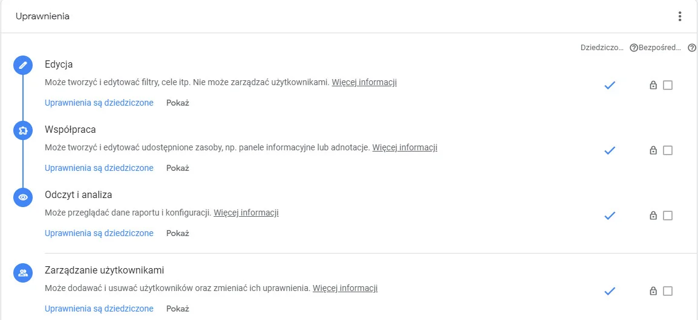

Użytkownik, któremu nadajemy dostępy, jest informowany mailowo i może zalogować się do naszego konta GA za pomocą własnego maila i hasła. Warto pamiętać, aby po zakończeniu współpracy cofać uprawnienia.

## 2. Łączenie kont w Google Analytics

Gdy już zatroszczyliśmy się o swoje dostępy, czas przejść do konfiguracji konta, a właściwie pozyskania trochę szerszego zakresu danych niż daje nam standardowo GA. Możemy to uzyskać poprzez łączenie kont. Sugerujemy połączenie konta Google Analytics z:

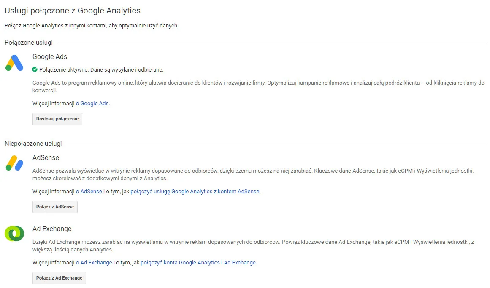

**Google Ads** - dzięki temu zyskujesz w obu narzędziach: w GA możesz analizować kampanie Google Ads, a w panelu Google Ads wzbogacisz statystyki o współczynnik odrzuceń, śr. czas trwania sesji i strony/sesję. Co więcej, możesz ustawić zbieranie list remarketingowych, czyli listy użytkowników, którzy odwiedzili Twoją witrynę. Dzięki temu możesz przeprowadzić później kampanię remarketingową, w oparciu o dowolne (ale zdefiniowane wcześniej) zachowania użytkowników. To może być np. kampania reklamowa do osób, które porzuciły koszyk. Taki sposób zbierania listy remarketingowej jest chyba najprostszy, bo inne metody wymagają ingerencji w kod strony, co dla niektórych właścicieli stron jest sporym utrudnieniem.

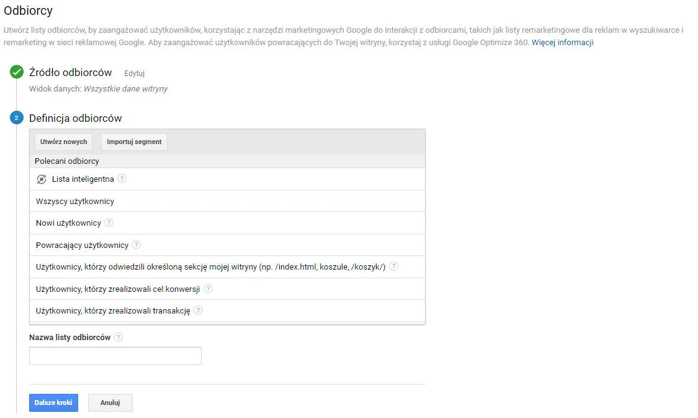

**Google Search Console** - jeśli chcesz w przyszłości analizować, **jakie zapytania wpisywali w Google użytkownicy, którzy odwiedzili Twoją witrynę**, musisz mieć konto Google Search Console. Aby ułatwić sobie życie, możesz je połączyć z GA i tym samym oglądać zapytania także w Google Analytics. Nie korzystasz z Google Search Console? Dobra wiadomość jest taka, że jeśli masz Google Analytics, rejestracja w Google Search Console jest dziecinnie prosta i nie wymaga żadnych technicznych umiejętności. Narzędzie na końcu procesu rejestracji musi zweryfikować, czy masz uprawnienia do danej strony internetowej i zrobi to automatycznie za pomocą Twojego konta Google Analytics. Pewnie nawet tego nie zauważysz.

## 3. Filtrowanie widoku

Filtr widoku w Google Analytics pozwala zbierać wybiórczo dane o ruchu na stronie. Jednym z podstawowych filtrów jakie warto wdrożyć to odfiltrowanie ruchu pracowników na stronę, a także ruchu pracowników współpracujących z nami agencji. To bardzo proste - wystarczy w panelu administracyjnym w kolumnie "Widok danych", wybrać opcję "Filtry". Za pomocą czerwonego przycisku dodajemy nowy filtr. W tym wypadku możemy skorzystać z predefiniowanego filtra i ustawić wykluczenie ruchu z adresu IP, który wklejamy w odpowiednim okienku.

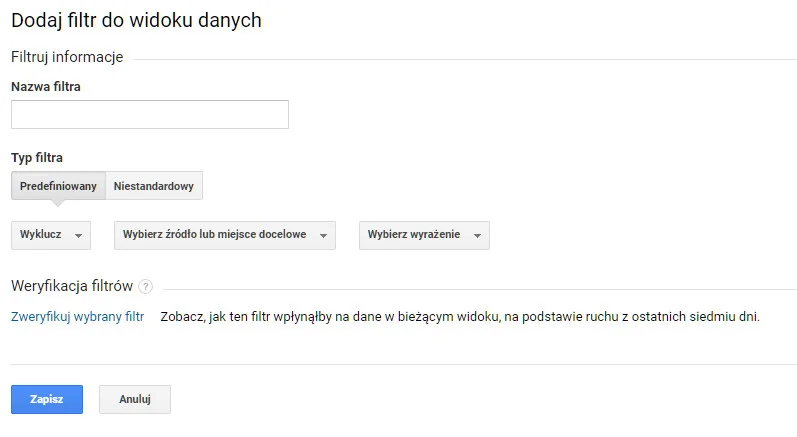

Oczywiście filtry to zaawansowana funkcja Google Analytics i można z nimi zrobić znacznie więcej, np. możemy odfiltrować:

- **ruch na wybrane podstrony naszego serwisu** - Masz rozbudowany blog, który świetnie buduje Twój wizerunek i generuje ogromny ruch, ale nijak nie ma się on do sprzedaży? Jeśli chcesz analizować wyłącznie ruch związany ze stronami ofertowymi, zastosuj filtr.

- **ruch z określonej lokalizacji geograficznej** - To pozwoli np. wybrać do analizy ruch z wybranego miasta i badać zachowania i konwersje wyłącznie użytkowników z danej lokalizacji. Dzięki temu możesz np. rozpoznać różne potrzeby klientów z różnych miast/regionów i podejmować lepsze decyzje przy budowie kampanii reklamowych dla tych grup.

- **ruch z wybranego kanału** - A może chcesz zbadać ruch i zachowania odbiorców pochodzących np. z ruchu mobilnego? Dzięki filtrom możesz wybrać, jaki typ urządzeń Cię interesuje, a nawet jakie technologie chcesz brać pod uwagę. Inna sytuacja to wykluczenie ruchu z bankowości i szybkich płatności, nie ma potrzeby zliczania takiego ruchu jako odesłania, bo w rzeczywistości nie jest to żadne odesłanie, a powrót do realizowanej w sklepie czynności.

- **ruch z wybranej domeny** - Realizujesz nowy projekt i prowadzisz testy? Nie ma sensu zliczać ruchu na stronę z własnych, testowych domen, dlatego wyklucz je za pomocą predefiniowanego filtra.

A oprócz predefiniowanych filtrów Google Analytics oferuje tworzenie własnych filtrów, co na wymaga już pewnej wiedzy, m.in. umiejętności stosowania wyrażeń regularnych.

**Ważne jest, aby przy stosowaniu filtrów tworzyć nowe widoki, które będziemy filtrować**, a jeden widok zawsze zostawić w wersji oryginalnej. Filtr nie polega na tym, że dane, których nie chcemy będą zbierać się gdzieś na boku i sięgniemy po nie w każdej chwili. Więc gdyby okazało się, że jednak źle ustawiliśmy filtr albo że filtrowanie nie ma sensu, nie odzyskamy tych danych. Dla bezpieczeństwa zalecamy więc zachowanie dodatkowo widoku niefiltrowanego.

## 4. Segmentowanie danych

Segmenty pod wieloma względami zastępują filtry, ale z założenia **mają służyć do tymczasowego wyselekcjonowania danych, podczas gdy filtry działają na stałe.** Segment możemy ustawić zgodnie z bieżącymi potrzebami - ułatwiając sobie analitykę. Google Analytics dostarcza predefiniowane segmenty, z którymi możemy np. ograniczyć wyświetlanie danych do ruchu z wybranego kanału, wygenerowanego za pomocą wybranego typu urządzenia, a także do sesji zakończonych konwersją. Segmentów jest wiele, a może być jeszcze więcej, bo poza predefiniowanymi segmentami, możemy dodać swoje własne.

Możemy konfigurować segmenty w obszarze: **danych demograficznych, technologii, zachowań (sesji, transakcji itp.), daty pierwszej wizyty, źródeł wizyt i zaawansowanych segmentów: warunków i sekwencji.** Przy zaawansowanych filtrach potrzebna jest wiedza na temat działania wyrażeń regularnych. W przypadku segmentu "sekwencje" mamy do czynienia ze skupieniem się na analityce użytkowników dokonujących podobnych działań w obrębie strony, działań, które określamy za pomocą sekwencji. Na przykład w ten sposób możemy przeanalizować ruch i zachowania użytkowników, którzy dodali produkt do koszyka, ale nie przeszli od razu do płatności, tylko wrócili do przeglądania strony.

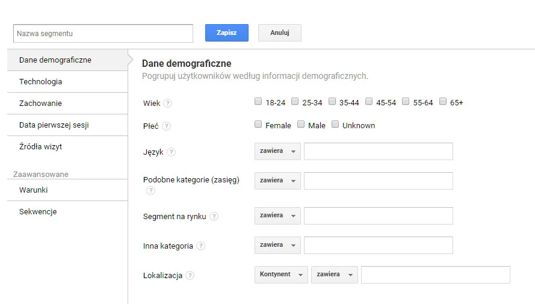

Zaletą segmentów w porównaniu z filtrami widoku jest **możliwość ustawiania ich bez posiadania najwyższego dostępu do konta Google Analytics.** Inna korzyść jest taka, że segmenty nie niosą za sobą ryzyka utraty danych - jednym kliknięciem przywrócimy widok na wszystkie dane.

## 5. Cele

Pierwszym krokiem jest **ustalenie, co jest dla nas konwersją.** W przypadku firm sprawa jest oczywista - konwersją będzie działanie, które wskazuje na potencjalny zysk, np. zapytanie ofertowe lub zakup produktu. Jednak cele mogą wykraczać poza sprzedaż i odnosić się także do innych korzyści, np. dla blogera może to być korzyść związana z zapisaniem się na newsletter albo odtworzeniem filmu. W każdym przypadku musimy najpierw dany cel określić w panelu Google Analytics, aby później móc go mierzyć.

## 6. Alerty

W panelu administracyjnym można ustawić alerty - są to **powiadomienia w przypadku nietypowych zmian w statystykach strony.** Jeśli nie mamy potrzeby stałego monitorowania Google Analytics, takie alerty ułatwią pracę i sprawią, że nie przeoczymy żadnego kryzysu. Można je łatwo ustawić w panelu administracyjnym Google Analytics.

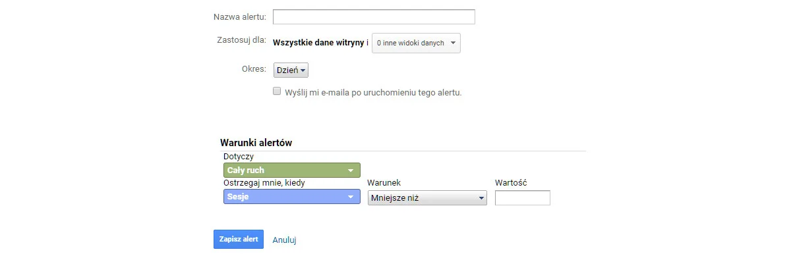

Źródło: [widoczni.com](https://widoczni.com/blog/jak-korzystac-z-google-analytics/)