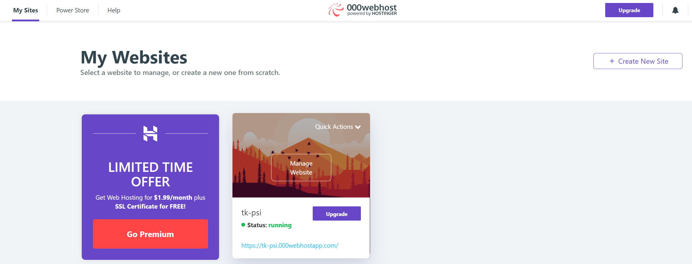
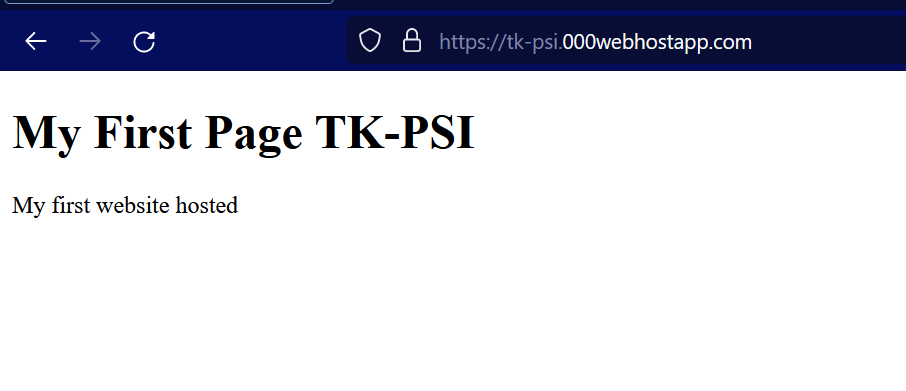

# web-development-course

`Jakub Piskorowski on 14/04/2023 wersja: 1.0`

## Temat: Publikacja strony

Omówienie publikacji strony w internecie

Pliki źródłowe:
- [index.html](./index.html)

--- 

## 1. Cele publikacji strony internetowej

Celem publikacji strony internetowej może być wiele różnych rzeczy, w zależności od rodzaju strony oraz celów jej twórców. Poniżej przedstawiam kilka powszechnych celów publikacji stron internetowych:

- **Informowanie** – Strony internetowe często służą do przekazywania informacji na określony temat. Mogą to być strony internetowe firmowe, które opisują ofertę i działalność przedsiębiorstwa, strony rządowe z informacjami dla obywateli, strony tematyczne, takie jak blogi lub portale informacyjne, które publikują artykuły na różne tematy.
- **Promowanie** – Strony internetowe mogą być również narzędziem promocji produktów lub usług. Firmy często tworzą strony internetowe, które reklamują ich produkty lub usługi, a także oferują możliwość zakupu online. Strony internetowe mogą też promować organizacje non-profit, przedstawiając ich cele i działania.
- **Edukowanie** – Strony internetowe mogą służyć również jako narzędzie edukacyjne, oferując materiały do nauki w formie kursów, lekcji online, tutoriali lub innych materiałów edukacyjnych.
- **Rozrywka** – Strony internetowe mogą również służyć jako narzędzie rozrywkowe, oferując użytkownikom gry, filmy, muzykę, zabawki, quizy i inne formy rozrywki.
- **Budowanie relacji** – Strony internetowe mogą służyć również do budowania relacji z klientami lub odbiorcami. Firmy często oferują na swoich stronach internetowych możliwość kontaktu z klientami, a także prowadzą blogi, na których publikują treści związane z ich branżą lub tematami interesującymi dla ich klientów.

**Podsumowując**, cele publikacji strony internetowej zależą od konkretnego celu, jakim ma służyć ta strona. Może to być informowanie, promowanie, edukacja, rozrywka lub budowanie relacji.

## 2. Podstawowe pojęcia związane z publikacją strony

Oto wyjaśnienia podstawowych pojęć związanych z publikacją stron internetowych:

- **Domena** – Domena to adres internetowy, który umożliwia użytkownikom dostęp do strony internetowej. Domena składa się z nazwy oraz rozszerzenia, np. "example.com". Nazwa domeny jest unikalna i pozwala na łatwe zapamiętanie adresu strony. Domeny można zakupić od rejestratorów domen, a ich koszt zależy od wybranej nazwy oraz rozszerzenia.
- **Hosting** – Hosting to usługa polegająca na udostępnieniu miejsca na serwerze, na którym można przechowywać pliki związane z stroną internetową. Dzięki temu użytkownicy mogą mieć dostęp do strony internetowej, a właściciele strony mogą przechowywać na serwerze wszystkie pliki potrzebne do jej działania. Hosting można zakupić u dostawców usług hostingowych, którzy udostępniają serwery do przechowywania stron internetowych.
- **Szablony stron** – Szablony stron to gotowe wzory stron internetowych, które można wykorzystać do szybkiego stworzenia własnej strony. Szablony zawierają już skomponowany układ, kolorystykę oraz często elementy graficzne, które można dostosować do własnych potrzeb. Szablony można zakupić w sklepach internetowych lub otrzymać wraz z narzędziami do tworzenia stron, np. CMS (Content Management System).

**Podsumowując**, domena to adres internetowy, hosting to usługa przechowywania plików związanych z stroną internetową na serwerze, a szablony stron to gotowe wzory stron, które można wykorzystać do szybkiego stworzenia własnej strony internetowej.

## 3. Korzyści z publikacji strony internetowej

Publikacja strony internetowej może przynieść wiele korzyści, zarówno dla firm, organizacji, jak i dla osób prywatnych. Oto kilka najważniejszych korzyści z publikacji strony internetowej:

- **Zwiększenie widoczności** – Strona internetowa umożliwia firmie lub organizacji dotarcie do znacznie większej liczby potencjalnych klientów lub odbiorców. Dzięki temu można zwiększyć świadomość marki i zainteresowanie ofertą.
- **Promocja i reklama** – Strona internetowa stanowi doskonałe narzędzie promocji i reklamy. Dzięki niej można informować o nowych produktach, ofertach promocyjnych, kampaniach marketingowych itp.
- **Łatwy dostęp do informacji** – Strona internetowa pozwala na łatwy dostęp do informacji na temat firmy, organizacji lub jej oferty. Użytkownicy mogą łatwo znaleźć potrzebne informacje, takie jak godziny otwarcia, adres, numer telefonu, cennik, opis produktów czy usług.
- **Budowanie wizerunku** – Strona internetowa może przyczynić się do budowania wizerunku firmy lub organizacji. Dzięki starannemu zaprojektowaniu strony oraz jej treści, można zyskać pozytywne wrażenie wśród klientów i zwiększyć zaufanie do marki.
- **Sprzedaż online** – Strona internetowa może umożliwić sprzedaż produktów lub usług online, co może zwiększyć zyski firmy i usprawnić proces sprzedaży.
- **Komunikacja z klientami** – Strona internetowa może służyć jako narzędzie do komunikacji z klientami. Dzięki formularzom kontaktowym, chatom czy emailom, użytkownicy mogą łatwo skontaktować się z firmą lub organizacją, zadając pytania lub zgłaszając uwagi.

**Podsumowując**, publikacja strony internetowej może przynieść wiele korzyści, takich jak zwiększenie widoczności, promocja i reklama, łatwy dostęp do informacji, budowanie wizerunku, sprzedaż online czy komunikacja z klientami.

## 4. Kryteria wyboru odpowiedniej usługi hostingowej

Wybór odpowiedniej usługi hostingowej jest kluczowy dla prawidłowego funkcjonowania strony internetowej. Oto kilka kryteriów, które warto wziąć pod uwagę przy wyborze usługi hostingowej:

- **Przepustowość i pojemność dysku** – W zależności od rodzaju strony internetowej, potrzebujemy odpowiedniej przepustowości i pojemności dysku. Strona z dużą ilością treści multimedialnych wymaga większej przepustowości i pojemności dysku.
- **Bezpieczeństwo** – Bezpieczeństwo strony internetowej jest bardzo ważne, dlatego warto wybrać usługę hostingową, która zapewnia ochronę przed atakami oraz kopie bezpieczeństwa.
- **Dostępność** – Dostępność to czas, w którym strona internetowa jest dostępna dla użytkowników. Warto wybrać usługę hostingową, która gwarantuje wysoką dostępność strony.
- **Wsparcie techniczne** – Wsparcie techniczne to bardzo ważne kryterium przy wyborze usługi hostingowej. Dobra usługa hostingowa powinna oferować szybką i skuteczną pomoc techniczną w razie problemów.
- **Koszt** – Koszt usługi hostingowej jest jednym z ważniejszych kryteriów, ale nie powinien być jedynym. Warto wybrać usługę hostingową, która zapewnia wszystkie potrzebne funkcjonalności, a jednocześnie jest dostępna w atrakcyjnej cenie.
- **Rodzaj hostingu** – Istnieją różne rodzaje hostingu, takie jak hosting współdzielony, VPS, dedykowany czy chmurowy. Każdy z nich ma swoje zalety i wady, dlatego warto dokładnie poznać różnice między nimi i wybrać ten, który najlepiej odpowiada potrzebom naszej strony.
- **Szybkość** – Szybkość działania strony internetowej ma wpływ na jej pozycję w wynikach wyszukiwania oraz zadowolenie użytkowników. Dlatego warto wybrać usługę hostingową, która zapewnia wysoką szybkość ładowania strony.

**Podsumowując**, wybór odpowiedniej usługi hostingowej powinien uwzględniać kryteria takie jak przepustowość i pojemność dysku, bezpieczeństwo, dostępność, wsparcie techniczne, koszt, rodzaj hostingu oraz szybkość działania. Ważne jest, aby wybrać usługę, która spełni wszystkie potrzeby naszej strony internetowej.

## 5. Wybór domeny a widoczność strony w wyszukiwarkach

Wybór domeny może mieć wpływ na widoczność strony w wyszukiwarkach internetowych. Oto kilka czynników, które warto wziąć pod uwagę przy wyborze domeny:

- **Spójność z tematyką strony** – Domena powinna odzwierciedlać tematykę strony. Na przykład, dla strony sprzedającej ubrania domena "modne-ubrania.pl" będzie bardziej odpowiednia niż "niebieskie-auta.pl".
- **Krótkość i prostota** – Krótkie i łatwe do zapamiętania domeny są łatwiejsze do wyszukiwania i zapamiętania dla użytkowników.
- **Unikalność** – Unikalna nazwa domeny zwiększa szanse na odnalezienie strony przez wyszukiwarki internetowe.
- **Rozszerzenie domeny** – Rozszerzenie domeny może wpłynąć na widoczność strony w określonych regionach. Na przykład, jeśli strona jest przeznaczona dla użytkowników w Polsce, warto wybrać rozszerzenie ".pl".
- **Słowa kluczowe** – Domena zawierająca słowa kluczowe związane z tematyką strony może pomóc w jej pozycjonowaniu w wynikach wyszukiwania.
- **Historia domeny** – Jeśli wybieramy istniejącą domenę, warto sprawdzić jej historię, aby upewnić się, że nie była wykorzystywana do nieetycznych działań, co mogłoby wpłynąć na pozycjonowanie strony.

**Podsumowując**, wybór domeny może mieć wpływ na widoczność strony w wyszukiwarkach internetowych. Warto wybierać krótkie, łatwe do zapamiętania, unikalne i spójne z tematyką strony domeny. Domena zawierająca słowa kluczowe związane z tematyką strony może pomóc w pozycjonowaniu strony w wynikach wyszukiwania. Jednak nie należy przesadzać z umieszczaniem słów kluczowych w nazwie domeny, ponieważ może to negatywnie wpłynąć na pozycjonowanie strony.

## 6. Stworzenie atrakcyjnej i przyciągającą uwagę treści

Oto kilka zasad, które pomogą w stworzeniu atrakcyjnej i przyciągającej uwagę treści:

- **Określ cel** – Zanim rozpoczniesz pisanie, określ cel swojej treści. Czy chcesz przekazać wiedzę, zachęcić do działania, rozrywki czy czegoś innego? Pamiętaj, że treść powinna odpowiadać na potrzeby twojej grupy docelowej.
- **Dopasuj styl pisania** – Styl pisania powinien być dostosowany do celu i grupy docelowej. Użyj odpowiedniego języka i stylu, np. jeśli piszesz dla młodzieży, warto użyć bardziej casualowego języka.
- **Wyróżnij nagłówek** – Nagłówek jest kluczowy w przyciągnięciu uwagi czytelnika. Powinien być krótki, zwięzły i przyciągający uwagę. Możesz użyć technik takich jak pytania, liczby, zapowiedzi, wstrząsy, etc.
- **Zastosuj krótkie akapity i podpunkty** – Krótkie akapity i podpunkty ułatwią czytanie treści, a także pozwolą czytelnikom szybko zidentyfikować najważniejsze informacje.
- **Użyj obrazów i multimediów** – Obrazy i multimediów przyciągają uwagę czytelnika, ułatwiają zrozumienie treści i zwiększają jej atrakcyjność.
- **Dopasuj długość tekstu** – Długość tekstu powinna być dostosowana do celu i grupy docelowej. Jeśli chcesz przekazać ważne informacje, warto użyć dłuższych tekstów. Jednak długie artykuły mogą zniechęcić czytelników, więc warto rozważyć podział tekstu na krótsze części.
- **Zwróć uwagę na formatowanie tekstu** – Formatowanie tekstu, takie jak pogrubienie, kursywa, wyróżnienie, etc. może pomóc w podkreśleniu ważnych informacji i ułatwić czytanie treści.

**Podsumowując**, aby stworzyć atrakcyjną i przyciągającą uwagę treść, warto określić cel i grupę docelową, dopasować styl pisania i długość tekstu, użyć nagłówków, krótkich akapitów, obrazów i multimediów oraz zwrócić uwagę na formatowanie tekstu.

## 7. Publikacja strony na serwerze hostingowym

Oto kroki, które należy wykonać, aby opublikować stronę na serwerze hostingowym:

- **Wybierz hosting i zarejestruj konto** – Wybierz hosting, który najlepiej odpowiada Twoim potrzebom i zarejestruj konto na jego stronie internetowej.
- **Przygotuj pliki strony** – Przygotuj pliki strony, które mają zostać opublikowane na serwerze hostingowym. Pliki te powinny znajdować się w folderze, który zostanie umieszczony na serwerze.
- **Prześlij pliki na serwer** – Skorzystaj z protokołu FTP (File Transfer Protocol), aby przesłać pliki na serwer. Możesz skorzystać z dedykowanego programu FTP lub narzędzia, które dostarcza hosting.
- **Skonfiguruj ustawienia domeny** – Jeśli posiadasz już domenę, musisz skonfigurować jej ustawienia DNS, aby kierowała na serwer hostingowy. Jeśli kupiłeś domenę razem z hostingiem, ten krok zostanie wykonany automatycznie.
- **Przetestuj stronę** – Sprawdź, czy strona działa poprawnie, odwiedzając ją przez przeglądarkę internetową. Możesz także przetestować jej wydajność i szybkość za pomocą narzędzi takich jak Google PageSpeed Insights.
- **Zabezpiecz stronę** – Zadbaj o bezpieczeństwo swojej strony, np. poprzez stosowanie certyfikatów SSL czy konfigurację zapory ogniowej.

Po wykonaniu tych kroków strona powinna być już dostępna publicznie na serwerze hostingowym i gotowa do użytku.

## 8. Stworzenie strony na darmowym hostingu

1. Wchodzimy na stronę [hostinger.pl](https://www.hostinger.pl/)
2. Wybieramy plan Hostingowy na stronie [hostinger.pl/darmowy-hosting](https://www.hostinger.pl/darmowy-hosting)
3. Tworzymy nowe konto.
4. Weryfikujemy adres email klikając w link wysłany na naszą pocztę. 
5. Wybieramy jaki rodzaj strony będziemy tworzyć. Wybieramy **Learn Web development**. Dzięki temu otrzymujemy dostęp do darmowych kursów tworzenia stron internetowych.

6. Następnie podajemy nazwę naszego projektu oraz hasło.

7. Wybranie narzędzia do stworzenia naszej strony. Mamy do wyboru użycie buildera do stron, zainstalowanie WordPress lub wrzucenie własnych plików strony. Wybieramy opcję Wrzucenia własnych plików (**Upload your side**). 

8. Klikamy w "**Manage website**" na naszej nowo stworzonej stronie.

9. Wybieramy menadżer plików. (**File Manager**). Zostaniemy przekierowani do naszego menadżera plików.

10. Teraz wchodząc do folderu "**public_html**" możemy tam umieścić nasz główny plik strony nazwany "**index.html**".

11. Będąc w folderze public_html klikamy w **ikonę upload files** i wybieramy nasz plik z komputera (Na przykład: [index.html](./index.html)).

12. Po wybraniu pliku klikamy **Upload**.

13. Po poprawnym wrzuceniu naszej pierwszej strony, możemy wrócić do listy naszych stron. 

14. Teraz możemy kliknąć w adres naszej strony i zobaczyć jak ona wygląda. 

15. Gotowe!!! mamy udostępnioną naszą pierwszą stronę.

